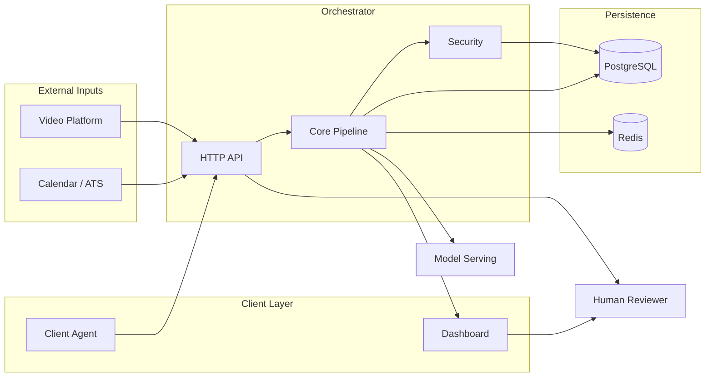

# Sherlock

> Real-time candidate identity and interview-integrity system for remote hiring.

Sherlock continuously evaluates whether the live interview participant matches
the applicant of record. Evidence from multiple weak signals is fused into a
Bayesian belief, routed through a lifecycle state machine, and surfaced to
human reviewers with deterministic explanations.

| | |
|---|---|
| **Status** | ✅ Complete — milestones M0 through M16 |
| **Scope** | Pilot implementation with intentional stub integrations |
| **Spec** | [`docs/architecture.md`](docs/architecture.md) (what) · [`docs/IMPLEMENTATION_PLAN.md`](docs/IMPLEMENTATION_PLAN.md) (how) |

Remaining gaps are **Pilot limitations** — stub integrations and deferred
production hardening — not missing milestone work.

---

## Table of contents

- [Project overview](#project-overview)
- [Design principles](#design-principles)
- [Features](#features)
- [Architecture](#architecture)
- [Repository structure](#repository-structure)
- [Technology stack](#technology-stack)
- [Getting started](#getting-started)
- [Running with Docker](#running-with-docker)
- [Running tests](#running-tests)
- [CI/CD](#cicd)
- [Evaluation](#evaluation)
- [Known limitations](#known-limitations)
- [Future production work](#future-production-work)
- [Roadmap](#roadmap)
- [References](#references)

---

## Project overview

Sherlock is a **modular monolith** with separate inference and client
deployables:

- **`orchestrator/`** — session state, evidence persistence, fusion, decision
  pipeline, and HTTP API
- **`model-serving/`** — GPU-bound embedding and liveness inference (Pilot
  stubs)
- **`dashboard/`** and **`client-agent/`** — reviewer UI and consented browser
  events over HTTP / SSE

The orchestrator HTTP API (`orchestrator/src/api/`) is wired in
`orchestrator/src/index.ts` for ingress, egress, and live dashboard updates.

### Milestones (M0–M16)

<details>
<summary><strong>Full milestone table</strong> — click to expand</summary>

| Milestone | Deliverable |
|-----------|-------------|
| **M0** | Contracts, repo scaffolding, CI/CD, Docker |
| **M1** | Evidence Store — `evidence_events` + `session_state_snapshots` |
| **M2** | Claim & Metadata bundle adapters, cold-start FSM subset |
| **M3** | Fusion Engine — log-odds, decay, Beta posterior |
| **M4** | Full eight-state lifecycle FSM with hysteresis |
| **M5** | Decision Engine — abstention, tie-break, alerts |
| **M6** | Explanation Engine — deterministic Evidence Reports |
| **M7** | Session routing (consistent-hash, Redis registry) + snapshot recovery |
| **M8** | Model-Serving Layer — embeddings, liveness, serving API, orchestrator client |
| **M9** | Visual & Audio bundles, CUSUM/change-point detection |
| **M10** | Client Agent + Device/OS bundle |
| **M11** | Active elicitation + Linguistic bundle |
| **M12** | LLM narrative layer (constrained, fact-validated; stub provider) |
| **M13** | Interviewer UI / Reviewer Dashboard (SSE, override, aggregate view) |
| **M14** | Signal-health contract enforcement, log-LR clamp, chaos tests |
| **M15** | Evaluation harness — replay, edge cases, ablation, ECE |
| **M16** | Security/privacy — field encryption, audit log, appeals |

</details>

| Phase | Milestones | Focus |
|-------|------------|-------|
| Foundation | M0–M2 | Contracts, evidence store, cold-start bundles |
| Intelligence | M3–M6 | Fusion, lifecycle FSM, decision, explanation |
| Scale & signals | M7–M11 | Routing, model serving, multimodal bundles |
| Product & quality | M12–M16 | LLM narrative, dashboard, signal health, eval, security |

---

## Design principles

| Principle | What it means in this codebase |
|-----------|--------------------------------|
| **Bayesian evidence fusion** | Log-odds accumulation with Beta-distributed posterior — not a point estimate |
| **Multiple weak signals** | Seven bundle families with bundle-local correlation containment and log-LR clamping |
| **Explainability** | Deterministic Evidence Reports per alert; LLM narrative cannot affect score or state |
| **Human-in-the-loop** | Abstention, reviewer override, and appeals — the system recommends, humans decide |
| **Clean Architecture** | Decision and explanation compose without cross-dependency; contracts define shared shapes |
| **Modular Monolith** | In-process domain modules in one deployable; GPU inference isolated in `model-serving/` |
| **Privacy by Design** | Field encryption at rest, audit logging on sensitive views, consented client capture |

---

## Features

### Core pipeline

- **Real-time candidate identification** — continuous, session-scoped belief
  about participant identity
- **Bayesian confidence estimation** — probability plus credible interval via
  Beta posterior
- **Multi-signal evidence fusion** — claim, metadata, visual, audio,
  linguistic, device, and elicitation bundles
- **Lifecycle State Machine** — eight states with hysteresis, dwell-time, and
  `LOST_CONFIDENCE` / `DISQUALIFIED` distinction
- **Decision Engine** — abstention (`UNKNOWN`), tie-breaking, elicitation
  triggers, and reviewer recommendations
- **Evidence Report generation** — ranked contributing signals, contradictions,
  and missing-evidence separation

### Interfaces & deployables

- **API layer** — HTTP ingress for all bundle families, SSE live updates,
  human override, appeals, and accommodation disclosure
- **Dashboard** — live badge, full lifecycle view, override actions, SSE
  subscription (`dashboard/`)
- **Client Agent** — consented device/OS event capture, timing metadata only
  (`client-agent/`)
- **Model Serving** — separate Python deployable for embeddings and liveness
  (Pilot stubs — no real GPU models loaded)

### Infrastructure & quality

- **Session routing and recovery** — consistent-hash ring, Redis registry,
  lifecycle snapshot restore on replica restart
- **Security** — AES field encryption for visual/audio evidence at rest,
  audit logging, and candidate appeal flow
- **Evaluation framework** — offline replay, edge-case regression, ablation,
  and calibration (`orchestrator/src/eval/`)

---

## Architecture

High-level deployables and data flow (M0–M16).



### Additional diagrams

| Diagram | Description |
|---------|-------------|
| [Runtime pipeline](docs/architecture-diagram-pipeline.md) | Participant → bundles → evidence → fusion → FSM → decision → explanation |
| [Infrastructure](docs/architecture-diagram-infrastructure.md) | PostgreSQL, Redis, routing, recovery, model serving, clients |
| [Repository layout](docs/architecture-diagram-repository.md) | Monorepo packages and orchestrator modules |
| [Diagram index](docs/architecture-diagram.md) | Full index with Pilot notes |

---

## Repository structure

### Package responsibilities

| Package | Responsibility |
|---------|----------------|
| `contracts/` | Shared Zod schemas — `EvidenceEvent`, signal-health contracts, bundle payloads |
| `orchestrator/` | Modular monolith — evidence store, bundles, fusion, FSM, decision, explanation, routing, API, security, eval |
| `model-serving/` | Python inference service — embeddings and liveness via FastAPI (Pilot stubs) |
| `dashboard/` | React reviewer UI — live badge, lifecycle state, override, SSE |
| `client-agent/` | Browser extension scaffold — consented device/OS timing events |

### Directory tree

```
.
├── contracts/              # @sherlock/contracts
├── orchestrator/           # modular monolith (RFC §9.2)
│   └── src/
│       ├── persistence/    # Evidence Store (M1)
│       ├── bundles/        # Bundle adapters (M2, M9–M11)
│       ├── fusion/         # Fusion engine (M3, M9, M14)
│       ├── statemachine/   # Lifecycle FSM (M2, M4)
│       ├── decision/       # Decision engine (M5)
│       ├── explanation/    # Evidence reports + LLM adapter (M6, M12)
│       ├── routing/        # Session registry, router, recovery (M7)
│       ├── modelserving_client/  # HTTP client (M8)
│       ├── api/            # HTTP ingress, SSE, orchestration (M8, M13)
│       ├── security/       # Encryption, audit, appeals (M16)
│       └── eval/           # Offline evaluation (M15)
├── model-serving/          # Python inference deployable (M8)
├── client-agent/           # Browser extension (M10)
├── dashboard/              # Reviewer UI (M13)
├── docs/                   # Architecture RFC + Implementation Plan
├── docker-compose.yml
├── Makefile
└── .github/workflows/ci.yml
```

---

## Technology stack

### Runtime & data

| Technology | Role |
|------------|------|
| TypeScript | Orchestrator, contracts, dashboard, client-agent |
| Node.js | Orchestrator runtime; npm workspace monorepo |
| React | Reviewer dashboard |
| Python | Model-serving inference |
| FastAPI | Model-serving HTTP API |
| PostgreSQL | Evidence events and session snapshots |
| Redis | Session registry for multi-replica routing |
| Docker | Local development and CI image builds |
| Zod | Runtime schema validation in `@sherlock/contracts` |

### Testing & tooling

| Technology | Role |
|------------|------|
| Vitest | TypeScript unit and integration tests |
| Pytest | Python model-serving tests |

| Concern | TypeScript workspaces | Python (`model-serving/`) |
|---------|----------------------|---------------------------|
| Dependencies | npm workspaces | `pyproject.toml` + `pip install -e ".[dev]"` |
| Lint / format | ESLint + Prettier | Ruff |
| Typing | `tsc --strict` | mypy (`strict = true`) |
| Logging | `pino` (JSON) | stdlib `logging` |

**Makefile entrypoints:** `make install` · `make lint` · `make format` ·
`make typecheck` · `make test` · `make build` · `make ci`

TypeScript handles IO-bound per-session orchestration; Python handles
GPU-bound inference (Implementation Plan §6).

---

## Getting started

**Prerequisites:** Node.js ≥ 20 · npm ≥ 10 · Python ≥ 3.11 · Docker (optional)

```bash
cp .env.example .env
make install          # TypeScript workspaces + Python package
make ci               # lint, typecheck, test, build
```

**Run services locally (no Docker):**

```bash
npm run dev --workspace=@sherlock/orchestrator
cd model-serving && pip install -e ".[dev]" && python -m model_serving.main
npm run dev --workspace=@sherlock/dashboard   # :5173 → orchestrator :8080
```

---

## Running with Docker

```bash
make docker-up        # postgres, redis, migrate, orchestrator, model-serving
make docker-logs
make docker-down
make migrate          # apply schema manually if needed
```

`docker compose up` runs a one-shot `migrate` service before the orchestrator
starts, so the Evidence Store schema is applied automatically.

| Service | Port |
|---------|------|
| Orchestrator | `8080` |
| Model Serving | `8081` |

---

## Running tests

| Mode | Command | Requires |
|------|---------|----------|
| Default | `make test` | Nothing — mocks and in-memory fakes |
| DB + Redis | See below | Running Postgres and Redis |

```bash
make docker-up
make migrate
RUN_DB_INTEGRATION_TESTS=true RUN_REDIS_INTEGRATION_TESTS=true \
  npm run test --workspace=@sherlock/orchestrator
```

CI runs both integration suites on every push/PR — see [CI/CD](#cicd).

---

## CI/CD

Workflow: [`.github/workflows/ci.yml`](.github/workflows/ci.yml) — every push
and pull request.

| Job | Steps |
|-----|-------|
| `typescript` | Install → lint → format-check → typecheck → migrate → test (incl. Postgres & Redis) → build all TS workspaces |
| `python` | Install → lint → format-check → typecheck → test `model-serving` |
| `docker` | Build images + validate `docker-compose.yml` (gated on jobs above) |

---

## Evaluation

Offline tooling in `orchestrator/src/eval/` (M15). Validates pipeline behavior
without live interview traffic.

| Suite | Purpose |
|-------|---------|
| Unit tests | Per-module correctness (~700 tests across workspaces) |
| Integration tests | Full pipeline; optional Postgres and Redis suites |
| Chaos tests | Signal-health enforcement and log-LR clamp (M14) |
| Replay evaluation | Deterministic re-run of recorded evidence sequences |
| Calibration | Expected calibration error (ECE) on held-out scenarios |
| Edge-case regression | RFC §11 — cold start, contradiction, modality dropout |

```bash
make ci    # full local check
```

---

## Known limitations

Pilot-scope gaps in the current implementation:

| Area | Limitation |
|------|------------|
| LLM narrative | `StubLlmProvider` only — no real LLM API |
| CUSUM state | Change-point accumulators in-memory; not restored from snapshots |
| Client Agent | No clipboard/paste content script; hardcoded orchestrator URL |
| Dashboard | Evidence Report and narrative not rendered in UI |
| Bundles H/I | Contract types only — no meta / cross-session adapters |
| Accommodation | Recorded but not wired into fusion signal suppression (ADR-13 partial) |
| Contracts | `LifecycleState` and `EvidenceReport` not yet in `@sherlock/contracts` |

---

## Future production work

Intentionally deferred beyond the Pilot (ADR-14 — add complexity at measured
scale, not ahead of need):

| Area | Work required |
|------|---------------|
| ML models | Production GPU models, deepfake/voice-clone classifiers, ASR |
| Authentication | RBAC on HTTP endpoints, override, and ingestion |
| Compliance stores | Postgres-backed audit log, appeals, accommodations |
| ATS integration | Real ATS/scheduling client replacing `InMemoryAtsClient` |
| Multi-replica | Wire `SessionRouter` into ingress (built, tested; single-replica entrypoint today) |

---

## Roadmap

All planned milestones **M0–M16 are complete**.

See [`docs/IMPLEMENTATION_PLAN.md`](docs/IMPLEMENTATION_PLAN.md) §7 for
original sequencing. Next steps follow production needs and measured scale
thresholds.

---

## References

| Document | Description |
|----------|-------------|
| [`docs/architecture.md`](docs/architecture.md) | Architecture RFC — authoritative _what_ |
| [`docs/IMPLEMENTATION_PLAN.md`](docs/IMPLEMENTATION_PLAN.md) | Implementation Plan — authoritative _how_ |
| [`docs/architecture-diagram.md`](docs/architecture-diagram.md) | Diagram index + Pilot notes |
| [`docs/architecture-diagram-pipeline.md`](docs/architecture-diagram-pipeline.md) | Runtime processing pipeline |
| [`docs/architecture-diagram-infrastructure.md`](docs/architecture-diagram-infrastructure.md) | Infrastructure and deployables |
| [`docs/architecture-diagram-repository.md`](docs/architecture-diagram-repository.md) | Monorepo package relationships |
