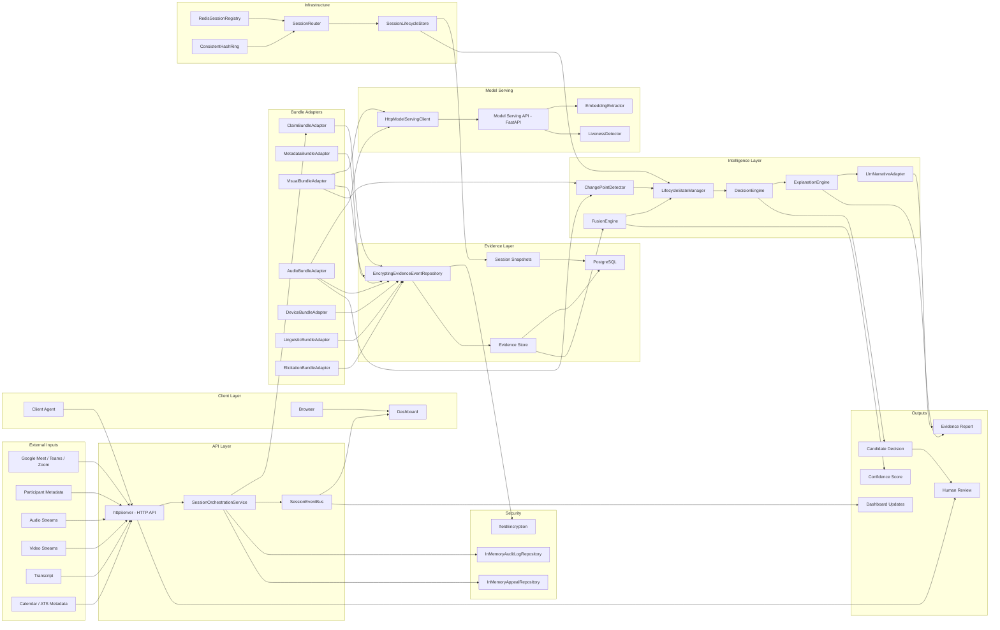

# Sherlock — Real-Time Candidate Identity & Interview-Integrity System

This repository implements the system designed in [`docs/architecture.md`](docs/architecture.md)
(the Architecture RFC — the **only** authoritative source for _what_ to
build) following the sequencing in
[`docs/IMPLEMENTATION_PLAN.md`](docs/IMPLEMENTATION_PLAN.md) (the
Implementation Plan — the authoritative source for _how_ to build it,
incrementally). Neither document is redesigned, simplified, or
second-guessed by this codebase; implementation follows them faithfully,
milestone by milestone.

## Current status: M0–M16 complete

All planned milestones in `docs/IMPLEMENTATION_PLAN.md` §7 are implemented.
The system runs end-to-end from evidence ingestion through Bayesian fusion,
lifecycle state management, decision and explanation, API exposure, dashboard
updates, and offline evaluation — with Pilot-scope stubs where the plan
explicitly defers production integrations (real ML models, ATS, LLM provider,
authentication).

| Milestone | Deliverable |
|-----------|-------------|
| **M0** | Contracts, repo scaffolding, CI/CD, Docker |
| **M1** | Evidence Store — `evidence_events` + `session_state_snapshots` |
| **M2** | Claim & Metadata bundle adapters, cold-start FSM subset |
| **M3** | Fusion Engine — log-odds, decay, Beta posterior |
| **M4** | Full eight-state lifecycle FSM with hysteresis |
| **M5** | Decision Engine — abstention, tie-break, alerts |
| **M6** | Explanation Engine — deterministic Evidence Reports |
| **M7** | Session routing (consistent-hash, Redis registry) + snapshot recovery |
| **M8** | Model-Serving Layer — embeddings, liveness, serving API, orchestrator client |
| **M9** | Visual & Audio bundles, CUSUM/change-point detection |
| **M10** | Client Agent + Device/OS bundle |
| **M11** | Active elicitation + Linguistic bundle |
| **M12** | LLM narrative layer (constrained, fact-validated; stub provider) |
| **M13** | Interviewer UI / Reviewer Dashboard (SSE, override, aggregate view) |
| **M14** | Signal-health contract enforcement, log-LR clamp, chaos tests |
| **M15** | Evaluation harness — replay, edge cases, ablation, ECE |
| **M16** | Security/privacy — field encryption, audit log, appeals |

The orchestrator also includes an HTTP API layer (`orchestrator/src/api/`)
named in the Plan's repository structure (§5) for ingress/egress; it was
built alongside the core pipeline and is fully wired in `orchestrator/src/index.ts`.

## Features

- **Real-time candidate identification** — continuous, session-scoped belief
  about whether the live participant matches the applicant of record
- **Bayesian confidence estimation** — log-odds fusion with Beta-distributed
  posterior (probability + credible interval), not a point estimate
- **Multi-signal evidence fusion** — seven bundle families (claim, metadata,
  visual, audio, linguistic, device, elicitation) with bundle-local correlation
  containment and per-event log-LR clamping
- **Explainable decision pipeline** — every alert paired with a deterministic
  Evidence Report; optional LLM narrative that cannot affect score or state
- **Lifecycle State Machine** — eight states with hysteresis, dwell-time,
  `LOST_CONFIDENCE`/`DISQUALIFIED` distinction, and permanent audit annotations
- **Decision Engine** — abstention (`UNKNOWN`), tie-breaking, elicitation
  triggers, reviewer recommendations; zero dependency on the explanation module
- **Evidence Report generation** — ranked contributing signals, contradictions,
  and missing-evidence separation
- **Session routing and recovery** — consistent-hash ring, Redis session
  registry, lifecycle snapshot restore on replica restart
- **API layer** — HTTP ingress for all bundle families, SSE live updates,
  human override, appeals, accommodation disclosure, aggregate `UNKNOWN` rate
- **Dashboard** — 3-tier live badge, full 8-state reviewer view, override
  actions, SSE subscription (`dashboard/`)
- **Client Agent** — consented device/OS event capture (timing metadata only;
  browser extension scaffold) (`client-agent/`)
- **Model Serving** — separate Python deployable for face/voice embeddings and
  visual liveness (Pilot stubs — no real GPU models loaded)
- **Security components** — AES field encryption for visual/audio evidence at
  rest, audit logging on biometric views, candidate appeal flow
- **Evaluation framework** — offline replay, §11 edge-case regression, ablation
  runner, expected calibration error (`orchestrator/src/eval/`)

## Architecture diagram

Implementation architecture (M0–M16), mapped to actual repository modules.
See [`docs/architecture-diagram.md`](docs/architecture-diagram.md) for the
source file and component notes.



## Repository layout

```
.
├── contracts/              # @sherlock/contracts — shared schemas (EvidenceEvent, signal-health, bundle payloads)
├── orchestrator/           # modular monolith deployable (RFC §9.2)
│   └── src/
│       ├── persistence/    # Evidence Store — repositories, migrations (M1)
│       ├── bundles/        # Bundle Adapters — claim/, metadata/, visual/, audio/, linguistic/, device/, elicitation/ (M2, M9–M11)
│       ├── fusion/         # Fusion Engine — Beta posterior, decay, LR registry, change-point, log-LR clamp (M3, M9, M14)
│       ├── statemachine/   # cold-start subset (M2) + full 8-state lifecycle FSM (M4)
│       ├── decision/       # Decision Engine — alerts, abstention, reviewer recommendation (M5)
│       ├── explanation/    # Evidence Report Engine + LLM narrative adapter (M6, M12)
│       ├── routing/        # Session Registry, Router, recovery-aware lifecycle store (M7)
│       ├── modelserving_client/  # HTTP client + adaptive sampling cadence (M8)
│       ├── api/            # HTTP ingress/egress, SSE event bus, orchestration service (M8 API, M13)
│       ├── security/       # Field encryption, audit log, appeals (M16)
│       └── eval/           # Replay, ablation, calibration, edge-case regression (M15)
├── model-serving/          # Python GPU-bound inference deployable — embeddings, liveness, serving API (M8; Pilot stubs)
├── client-agent/           # Browser extension — consented device/OS events (M10)
├── dashboard/              # Interviewer UI / Reviewer Dashboard — React + Vite (M13)
├── docs/
│   ├── architecture.md          # Architecture RFC (authoritative WHAT)
│   └── IMPLEMENTATION_PLAN.md   # Implementation Plan (authoritative HOW)
├── docker-compose.yml      # postgres, redis, migrate, orchestrator, model-serving
├── Makefile                # unified commands across TypeScript and Python workspaces
└── .github/workflows/ci.yml   # lint, typecheck, test, build, docker — every push/PR
```

## Why two languages

Per §6 of the Implementation Plan ("Technology Stack (Inferred)"), the RFC
specifies no language, only architectural properties:

- **`orchestrator/`, `contracts/`, `client-agent/`, `dashboard/` — TypeScript
  on Node.js / React.** The orchestrator's properties (many lightweight,
  memory/IO-bound, per-session state machines; in-process modules; horizontal
  replication) fit a typed runtime; TypeScript/Node.js was chosen as one of
  the RFC's named plausible fits.
- **`model-serving/` — Python.** Named directly in the plan as "the practical
  inference-ecosystem default" for GPU-bound classifiers and ASR.

## Prerequisites

- Node.js ≥ 20 and npm ≥ 10
- Python ≥ 3.11
- Docker and Docker Compose (for containerized local development)

## Getting started

```bash
cp .env.example .env

# Install everything (TypeScript workspaces + the Python package)
make install

# Lint, type-check, test, and build everything
make ci

# Or, run each deployable directly without Docker:
npm run dev --workspace=@sherlock/orchestrator
cd model-serving && pip install -e ".[dev]" && python -m model_serving.main
npm run dev --workspace=@sherlock/dashboard   # Vite on :5173; expects orchestrator at http://localhost:8080
```

### Running with Docker Compose

```bash
make docker-up      # postgres + redis + migrate + orchestrator + model-serving
make docker-logs
make docker-down
```

`docker compose up` runs a one-shot `migrate` service before starting the
orchestrator, so the Evidence Store schema is applied automatically. You can
also apply migrations manually at any time:

```bash
make migrate
```

The orchestrator listens on port **8080**; model-serving on **8081**.

### Running integration test suites

The default `make test` / `npm run test` runs entirely against mocks and
in-memory fakes — no external services required. To additionally exercise
real Postgres and Redis against live services:

```bash
make docker-up
make migrate
RUN_DB_INTEGRATION_TESTS=true RUN_REDIS_INTEGRATION_TESTS=true npm run test --workspace=@sherlock/orchestrator
```

CI runs both integration suites on every push/PR against service containers
(`.github/workflows/ci.yml`).

## Tooling reference

| Concern               | TypeScript (`contracts/`, `orchestrator/`, `client-agent/`, `dashboard/`) | Python (`model-serving/`)                                 |
| --------------------- | ------------------------------------------------------------------------ | --------------------------------------------------------- |
| Dependency management | npm workspaces                                                           | `pyproject.toml` (setuptools) + `pip install -e ".[dev]"` |
| Linting               | ESLint (flat config, `eslint.config.mjs`)                                | Ruff (`ruff check`)                                       |
| Formatting            | Prettier                                                                 | Ruff (`ruff format`)                                      |
| Typing                | `tsc --strict`                                                           | mypy (`strict = true`)                                    |
| Testing               | Vitest                                                                   | pytest                                                    |
| Logging               | `pino` (structured, JSON)                                                | stdlib `logging` (structured JSON-like formatter)         |

Every command above is also reachable through the root `Makefile` (`make
lint`, `make format`, `make typecheck`, `make test`, `make build`) so a
single entrypoint works across both languages.

## CI/CD

`.github/workflows/ci.yml` runs on every push and pull request:

1. **`typescript`** — install, lint, format-check, typecheck, migrate, test
   (including Postgres and Redis integration suites), build all four
   TypeScript workspaces (`contracts`, `orchestrator`, `client-agent`,
   `dashboard`).
2. **`python`** — install, lint, format-check, typecheck, test
   `model-serving`.
3. **`docker`** — build both deployables' Docker images and validate
   `docker-compose.yml`, gated on the two jobs above passing.

## Roadmap

**All planned milestones (M0–M16) are complete.** See
`docs/IMPLEMENTATION_PLAN.md` §7 for the original sequencing and rationale.

What remains is not unfinished milestone work — it is intentional Pilot-scope
limitation documented in code comments and listed below. Production hardening
(authentication, durable compliance stores, real ML models, multi-replica
routing enforcement) is deferred per the RFC's phased-infrastructure philosophy
(ADR-14): add complexity only against measured scale thresholds, not ahead of
need.

## Known limitations

These are genuine remaining gaps in the Pilot implementation, not missing
milestones:

- **Stub ML models** — `model-serving/` serves deterministic embedding and
  liveness stubs; no real GPU models, deepfake/voice-clone classifiers, or ASR
- **Stub ATS integration** — `InMemoryAtsClient` only; claim lookups report
  `SERVICE_UNAVAILABLE` until a real ATS/scheduling client is wired
- **Stub LLM provider** — narrative layer uses `StubLlmProvider` (deterministic
  template); no real LLM API configured
- **No production authentication** — all orchestrator HTTP endpoints are
  unauthenticated; human override and evidence ingestion have no RBAC
- **In-memory compliance stores** — audit log, appeals, and accommodation
  disclosures use in-memory repositories (not Postgres-backed)
- **Single-replica deployment** — `SessionRouter` is built and tested but not
  wired into `orchestrator/src/index.ts`; routing enforcement is deferred to
  the load balancer per RFC §9.4
- **Ephemeral CUSUM state** — embedding self-consistency and change-point
  detector accumulators are in-memory; not restored from snapshots after crash
- **Client Agent incomplete** — consent, event aggregation, and keyboard-rhythm
  timing are implemented; content script for clipboard/paste capture is not
  shipped; orchestrator URL is hardcoded for local dev
- **Dashboard partial** — live badge, lifecycle state, override, accommodation
  form, and SSE subscription work; structured Evidence Report and narrative are
  not rendered in the UI
- **Meta / cross-session bundles** — contract types exist; no bundle adapters
  (Bundle H/I deferred beyond Pilot scope)
- **Accommodation disclosure** — recorded and surfaced on session status, but
  not yet wired into fusion to suppress specific signals (ADR-13 partial)
- **Contracts scope** — `LifecycleState` and `EvidenceReport` shapes live in
  orchestrator/dashboard, not yet exported from `@sherlock/contracts`
