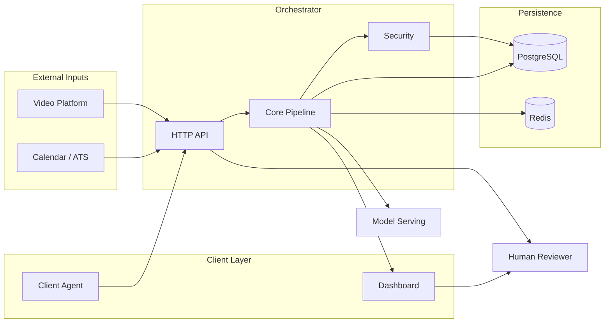
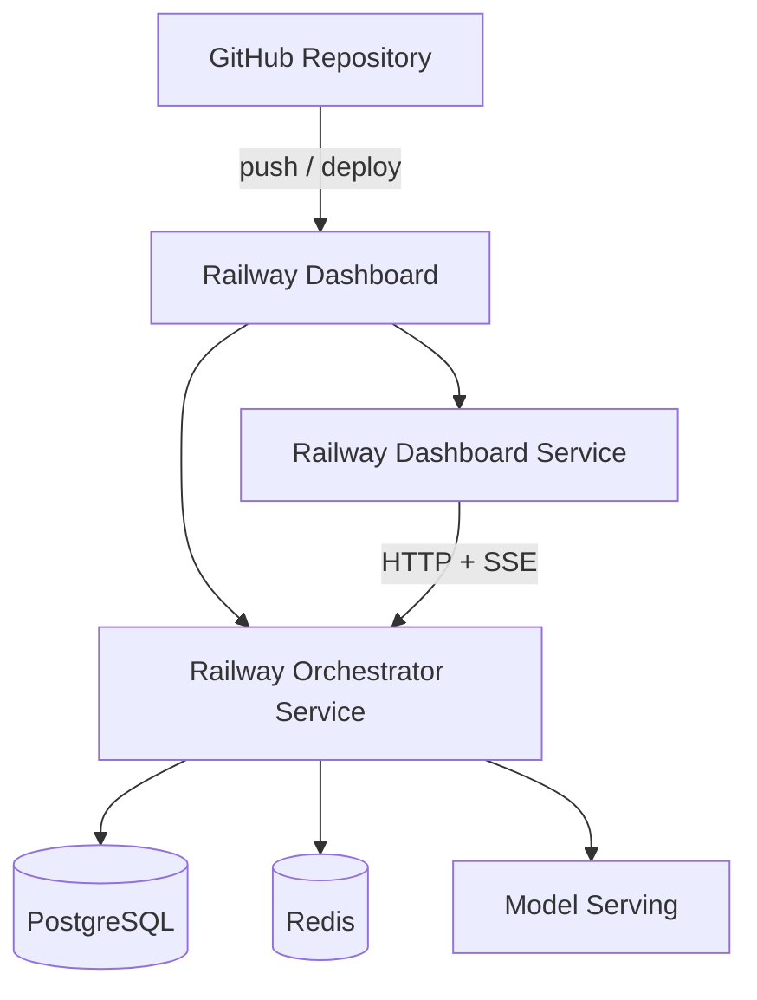

# Sherlock Interview Integrity System - v1.0.0

Sherlock hero

[Build Status](https://github.com/Vinayak150/sherlock-interview-integrity-system/actions)
[License](LICENSE)
[TypeScript](https://www.typescriptlang.org/)
[Python](https://www.python.org/)
[React](https://react.dev/)
[Railway](https://railway.app/)
[Docker](docker-compose.yml)

> Real-time AI-powered interview integrity analysis using Bayesian evidence fusion, lifecycle state machines, explainable decision making, and human-in-the-loop review.

|                |                                                                                                                                |
| -------------- | ------------------------------------------------------------------------------------------------------------------------------ |
| **Status**     | ✅ Complete — milestones M0 through M16                                                                                        |
| **Scope**      | Pilot implementation with intentional stub integrations                                                                        |
| **Repository** | [github.com/Vinayak150/sherlock-interview-integrity-system](https://github.com/Vinayak150/sherlock-interview-integrity-system) |

---

## Table of contents

- [Overview](#overview)
- [Features](#features)
- [Screenshots](#screenshots)
- [System architecture](#system-architecture)
- [Deployment architecture](#deployment-architecture)
- [Repository structure](#repository-structure)
- [Technology stack](#technology-stack)
- [Quick start](#quick-start)
- [Local development](#local-development)
- [Docker deployment](#docker-deployment)
- [Railway deployment](#railway-deployment)
- [Live demo](#live-demo)
- [Evaluation & CI](#evaluation--ci)
- [Known limitations](#known-limitations)
- [Future improvements](#future-improvements)
- [License](#license)
- [Acknowledgements](#acknowledgements)

---

## Overview

Sherlock continuously evaluates whether the live interview participant matches the applicant of record. Evidence from multiple weak signals is fused into a Bayesian belief, routed through an eight-state lifecycle machine, and surfaced to human reviewers with deterministic explanations.

The system is implemented as a **modular monolith** (`orchestrator/`) with separate inference (`model-serving/`) and client deployables (`dashboard/`, `client-agent/`). All planned milestones **M0–M16** are complete; remaining gaps are intentional **Pilot limitations**.

Authoritative specifications:

- `[docs/architecture.md](docs/architecture.md)` — what to build
- `[docs/IMPLEMENTATION_PLAN.md](docs/IMPLEMENTATION_PLAN.md)` — how to build it

---

## Features

### Core pipeline

- **Bayesian evidence fusion** — log-odds accumulation with Beta-distributed posterior
- **Seven bundle families** — claim, metadata, visual, audio, linguistic, device, elicitation
- **Lifecycle FSM** — eight states with hysteresis and `LOST_CONFIDENCE` / `DISQUALIFIED` distinction
- **Decision engine** — abstention, tie-breaking, alerts, reviewer recommendations
- **Explanation engine** — deterministic Evidence Reports; optional LLM narrative (stub)

### Product surfaces

- **Landing page** — enterprise marketing shell with architecture overview
- **Reviewer dashboard** — session search, live SSE updates, override, accommodation disclosure
- **Aggregate analytics** — unknown rate, lifecycle distribution, review queue (Recharts)
- **Dark mode** — system preference detection with persistent toggle

### Infrastructure

- **PostgreSQL** evidence store with field encryption for biometric data
- **Redis** session registry for multi-replica routing
- **Docker Compose** local stack with automatic migrations
- **Railway-ready** orchestrator (`PORT` binding) and static dashboard deploy

---

## Screenshots

### Landing page

Landing page


### Dashboard overview

Dashboard


### Reviewer workspace

Reviewer workspace

### Aggregate analytics

Aggregate dashboard

### Dark mode

Dark mode

Regenerate screenshots: `cd dashboard && npm run screenshots` — see `[docs/images/README.md](docs/images/README.md)`.

---

## System architecture

System architecture



### Additional diagrams

| Diagram                                                       | Description                                                   |
| ------------------------------------------------------------- | ------------------------------------------------------------- |
| [Runtime pipeline](docs/architecture-diagram-pipeline.md)     | Participant → bundles → fusion → FSM → decision → explanation |
| [Infrastructure](docs/architecture-diagram-infrastructure.md) | PostgreSQL, Redis, routing, recovery, model serving           |
| [Repository layout](docs/architecture-diagram-repository.md)  | Monorepo packages and orchestrator modules                    |
| [Diagram index](docs/architecture-diagram.md)                 | Full index with Pilot notes                                   |

---

## Deployment architecture

Deployment architecture



See `[docs/architecture-diagram-deployment.md](docs/architecture-diagram-deployment.md)` for environment variables and data flow.

---

## Repository structure

| Package          | Responsibility                                                                 |
| ---------------- | ------------------------------------------------------------------------------ |
| `contracts/`     | Shared Zod schemas — `EvidenceEvent`, signal-health, bundle payloads           |
| `orchestrator/`  | Modular monolith — evidence, fusion, FSM, decision, explanation, API, security |
| `model-serving/` | Python inference — embeddings and liveness via FastAPI (Pilot stubs)           |
| `dashboard/`     | React reviewer UI — landing page, workspace, aggregate analytics               |
| `client-agent/`  | Browser extension — consented device/OS timing events                          |

```
.
├── contracts/
├── orchestrator/src/
│   ├── persistence/   # Evidence store (M1)
│   ├── bundles/       # Bundle adapters (M2, M9–M11)
│   ├── fusion/        # Fusion engine (M3, M9, M14)
│   ├── statemachine/  # Lifecycle FSM (M2, M4)
│   ├── decision/      # Decision engine (M5)
│   ├── explanation/   # Evidence reports (M6, M12)
│   ├── routing/       # Session registry & recovery (M7)
│   ├── api/           # HTTP + SSE (M8, M13)
│   ├── security/      # Encryption, audit, appeals (M16)
│   └── eval/          # Offline evaluation (M15)
├── model-serving/
├── dashboard/
├── client-agent/
├── docs/
├── docker-compose.yml
└── .github/workflows/ci.yml
```

---

## Technology stack

| Technology      | Role                                             |
| --------------- | ------------------------------------------------ |
| TypeScript      | Orchestrator, contracts, dashboard, client-agent |
| Node.js         | Orchestrator runtime; npm workspaces             |
| React           | Landing page + reviewer dashboard                |
| Python          | Model-serving inference                          |
| FastAPI         | Model-serving HTTP API                           |
| PostgreSQL      | Evidence events and session snapshots            |
| Redis           | Session registry                                 |
| Docker          | Local development and CI                         |
| Tailwind CSS    | Dashboard styling                                |
| Recharts        | Aggregate analytics charts                       |
| Vitest / Pytest | TypeScript and Python tests                      |
| Zod             | Runtime schema validation                        |
| Railway         | Cloud deployment target                          |

---

## Quick start

```bash
git clone https://github.com/Vinayak150/sherlock-interview-integrity-system.git
cd sherlock-interview-integrity-system
cp .env.example .env
make install
make ci
```

---

## Local development

**Prerequisites:** Node.js ≥ 20 · npm ≥ 10 · Python ≥ 3.11

```bash
# Orchestrator
npm run dev --workspace=@sherlock/orchestrator

# Model serving
cd model-serving && pip install -e ".[dev]" && python -m model_serving.main

# Dashboard (landing page → Launch Dashboard)
npm run dev --workspace=@sherlock/dashboard
```

| Service       | Port   |
| ------------- | ------ |
| Orchestrator  | `8080` |
| Model Serving | `8081` |
| Dashboard     | `5173` |

Set `VITE_ORCHESTRATOR_URL=http://localhost:8080` when building the dashboard for a remote orchestrator.

---

## Docker deployment

```bash
make docker-up      # postgres, redis, migrate, orchestrator, model-serving
make docker-logs
make docker-down
```

`docker compose up` runs a one-shot `migrate` service before the orchestrator starts.

---

## Railway deployment

Deploy as separate Railway services:

### Orchestrator

1. Connect the GitHub repository.
2. Set root directory to `orchestrator/` (or use the Dockerfile).
3. Add **PostgreSQL** and **Redis** plugins; map `POSTGRES_`* and `REDIS_URL`.
4. Railway injects `PORT` — the orchestrator reads it automatically.
5. Set `MODEL_SERVING_URL` to the inference service URL.

### Dashboard

1. Create a static or Node service from `dashboard/`.
2. Build command: `npm run build --workspace=@sherlock/dashboard`
3. Start command: `npm run start --workspace=@sherlock/dashboard`
4. Set `VITE_ORCHESTRATOR_URL` at **build time** to the orchestrator public URL.

### Model serving

1. Deploy `model-serving/` with its Dockerfile.
2. Expose port `8081` (or Railway `PORT`).

See `[docs/architecture-diagram-deployment.md](docs/architecture-diagram-deployment.md)` for the full topology.

---

## Live demo

| Resource              | Link                                                                                                                |
| --------------------- | ------------------------------------------------------------------------------------------------------------------- |
| **GitHub repository** | [Vinayak150/sherlock-interview-integrity-system](https://github.com/Vinayak150/sherlock-interview-integrity-system) |
| **Architecture RFC**  | `[docs/architecture.md](docs/architecture.md)`                                                                      |
| **Dashboard (local)** | `npm run dev --workspace=@sherlock/dashboard` → open `http://localhost:5173`                                        |

Deploy to Railway and set `VITE_ORCHESTRATOR_URL` to publish a hosted demo.

---

## Evaluation & CI

| Suite                | Purpose                                        |
| -------------------- | ---------------------------------------------- |
| Unit tests           | ~700 tests across workspaces                   |
| Integration tests    | Optional Postgres and Redis suites             |
| Chaos tests          | Signal-health and log-LR clamp (M14)           |
| Replay / calibration | Offline eval in `orchestrator/src/eval/` (M15) |

CI: `[.github/workflows/ci.yml](.github/workflows/ci.yml)` — lint, typecheck, test, build, Docker on every push/PR.

```bash
make ci
```

---

## Known limitations

Pilot-scope gaps (not missing milestones):

| Area              | Limitation                                                           |
| ----------------- | -------------------------------------------------------------------- |
| ML models         | Stub embeddings and liveness — no production GPU models              |
| LLM narrative     | `StubLlmProvider` only                                               |
| Authentication    | HTTP endpoints unauthenticated                                       |
| Compliance stores | Audit log and appeals in-memory                                      |
| ATS integration   | `InMemoryAtsClient` only                                             |
| Multi-replica     | `SessionRouter` not wired at ingress                                 |
| Dashboard API     | Full Evidence Report not exposed via HTTP — partial display from SSE |
| Client agent      | Clipboard capture not shipped                                        |

---

## Future improvements

Production hardening deferred per ADR-14:

- Real ML models, ASR, and deepfake classifiers
- RBAC and production authentication
- Postgres-backed audit log, appeals, accommodations
- Real ATS/scheduling client
- Multi-replica ingress with `SessionRouter`
- Evidence Report API for full dashboard narrative rendering

---

## License

This project is provided for portfolio and technical evaluation purposes. See [LICENSE](LICENSE) if present in the repository; otherwise contact the repository owner for licensing terms.

---

## Acknowledgements

- Architecture and implementation plan authored as part of the Sherlock design exercise
- Built with TypeScript, React, Python, FastAPI, PostgreSQL, Redis, Docker, Tailwind CSS, and Recharts
- UI inspired by enterprise platforms (Stripe, Linear, Vercel) — minimal, accessible, production-oriented
- Deployed with [Railway](https://railway.app/) compatibility in mind

---

## References

| Document                                                                             | Description             |
| ------------------------------------------------------------------------------------ | ----------------------- |
| `[docs/architecture.md](docs/architecture.md)`                                       | Architecture RFC        |
| `[docs/IMPLEMENTATION_PLAN.md](docs/IMPLEMENTATION_PLAN.md)`                         | Implementation Plan     |
| `[docs/architecture-diagram.md](docs/architecture-diagram.md)`                       | Diagram index           |
| `[docs/architecture-diagram-deployment.md](docs/architecture-diagram-deployment.md)` | Railway deployment      |
| `[docs/images/README.md](docs/images/README.md)`                                     | Screenshot regeneration |
