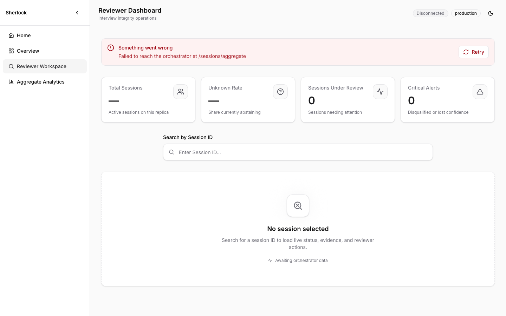
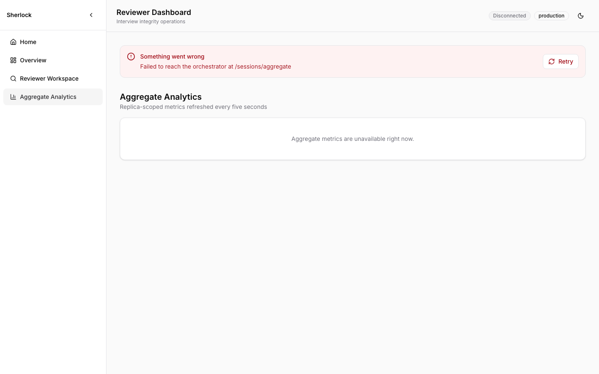
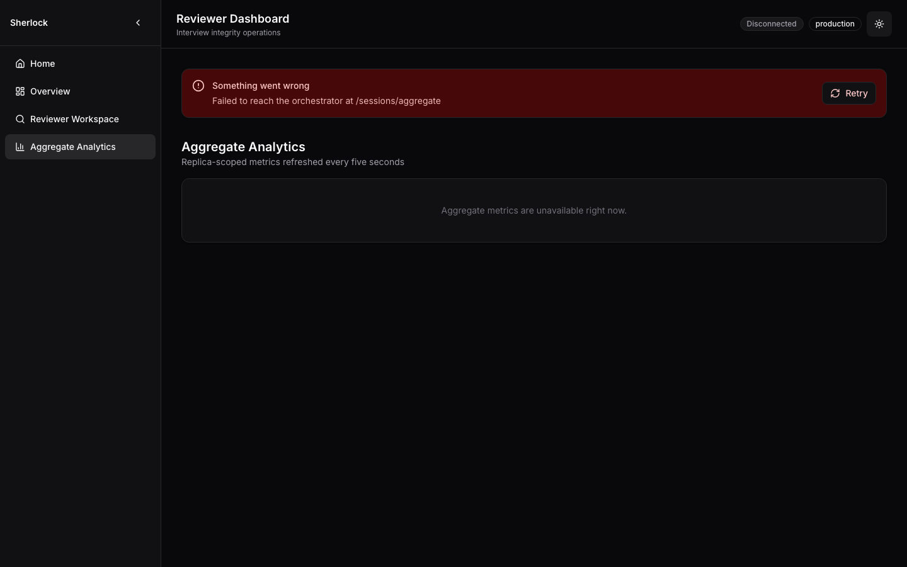
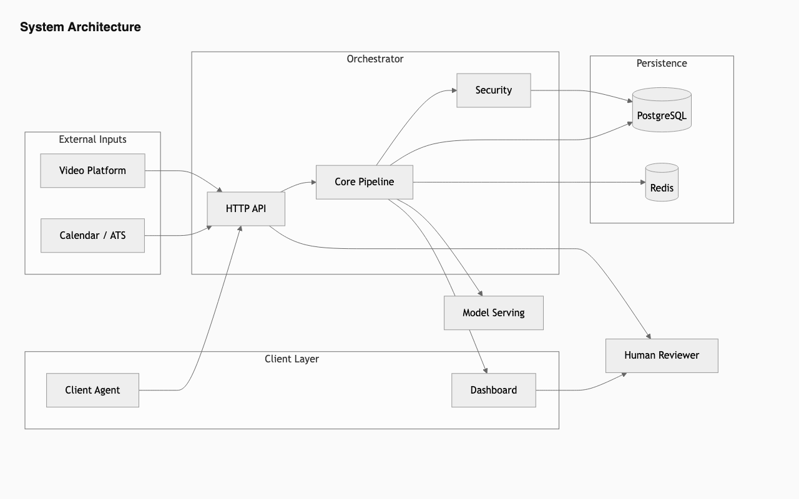
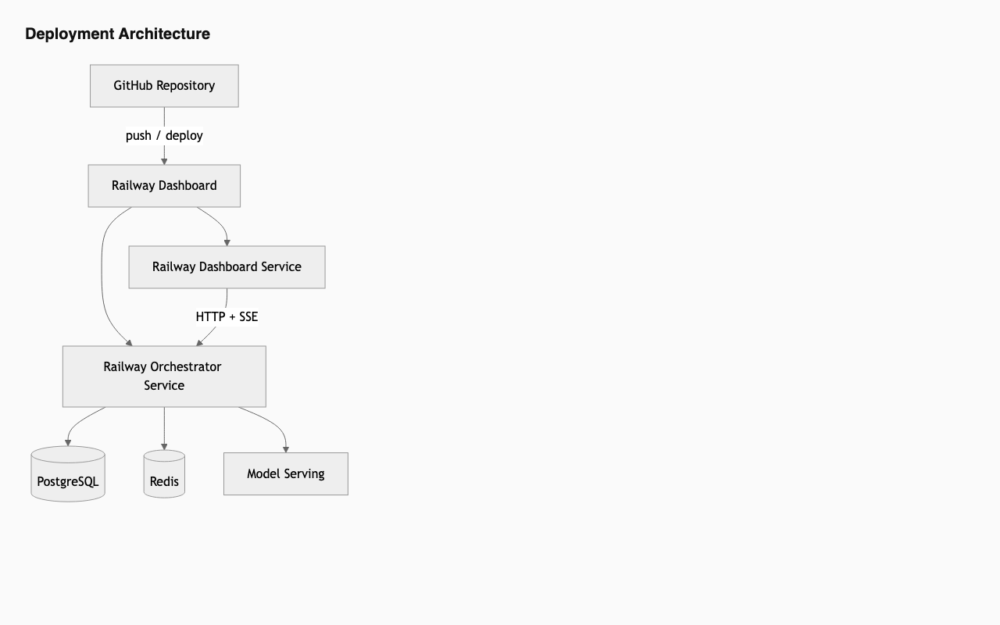
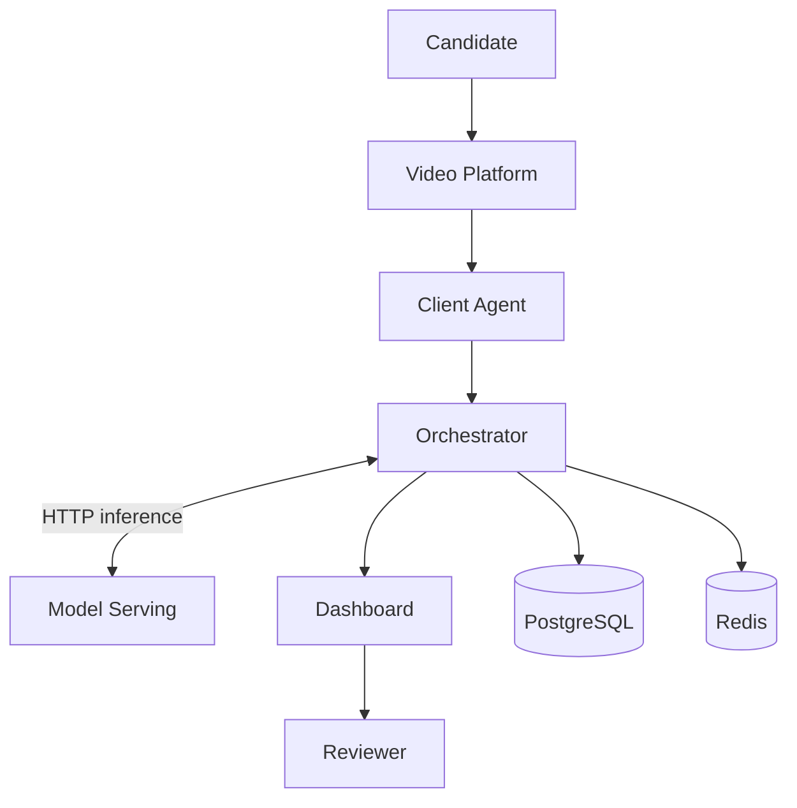
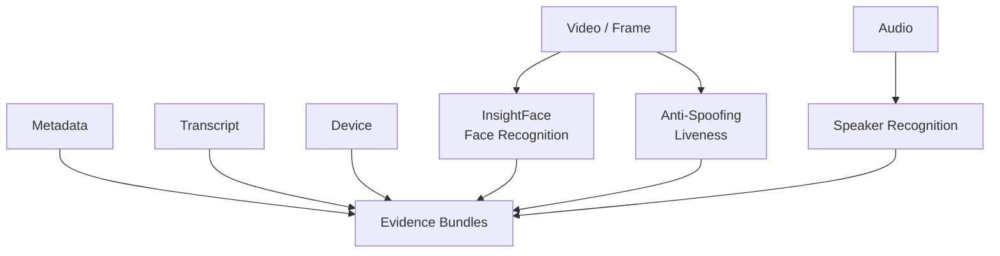
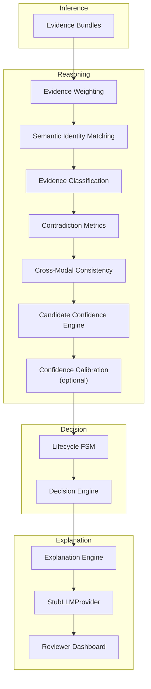
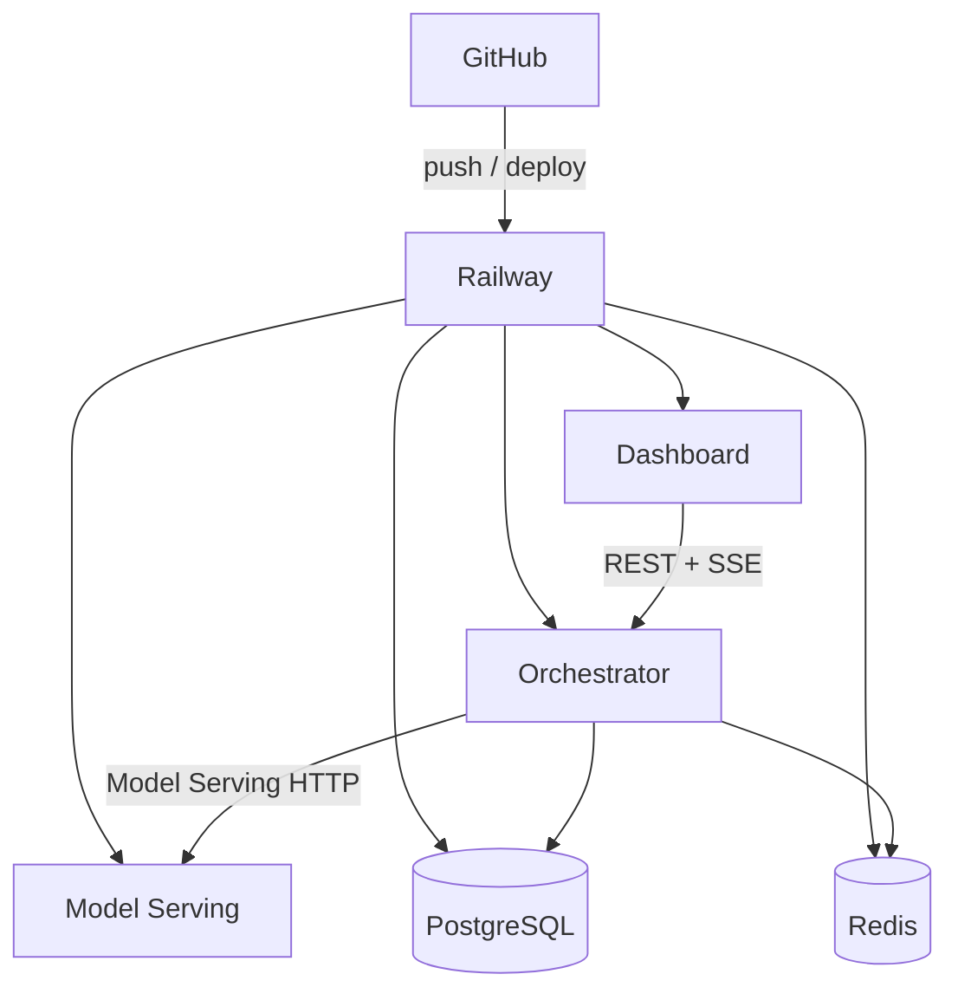

# Sherlock Interview Integrity System

[](https://github.com/Vinayak150/sherlock-interview-integrity-system/actions)
[TypeScript](https://www.typescriptlang.org/) · [Python](https://www.python.org/) · [React](https://react.dev/) · [Railway](https://railway.app/) · [Docker](docker-compose.yml)

> Real-time interview integrity analysis for hiring workflows — combining InsightFace face recognition, speaker embedding verification, anti-spoofing liveness detection, and Bayesian evidence fusion, with structured evidence reports and human-in-the-loop review.

| Field | Description |
| ----- | ----------- |
| **Status** | Complete — milestones M0 through M16 |
| **Scope** | Full orchestrator pipeline, production CPU inference (face, speaker, liveness), PostgreSQL evidence store, reviewer dashboard, Railway-ready deploy. Gaps in auth, ATS, and compliance persistence are documented under [Known limitations](#known-limitations). |
| **Repository** | [github.com/Vinayak150/sherlock-interview-integrity-system](https://github.com/Vinayak150/sherlock-interview-integrity-system) |

---

## Table of contents

- [Overview](#overview)
- [Features](#features)
- [Screenshots](#screenshots)
- [System architecture](#system-architecture)
- [Deployment architecture](#deployment-architecture)
- [Repository structure](#repository-structure)
- [Technology stack](#technology-stack)
- [Quick start](#quick-start)
- [Local development](#local-development)
- [Docker deployment](#docker-deployment)
- [Railway deployment](#railway-deployment)
- [Live demo](#live-demo)
- [Performance](#performance)
- [Evaluation & CI](#evaluation--ci)
- [Known limitations](#known-limitations)
- [Future roadmap](#future-roadmap)
- [References](#references)
- [License](#license)
- [Acknowledgements](#acknowledgements)

---

## Overview

Sherlock continuously evaluates whether the person in a live interview matches the applicant of record. The system ingests weak, partially correlated signals from seven evidence bundles, fuses them into a Bayesian posterior with uncertainty bounds, ranks candidate hypotheses through the Candidate Confidence Engine, and routes outcomes through an eight-state lifecycle machine. Reviewers receive deterministic Evidence Reports with contradiction reasoning and cross-modal consistency analysis; optional narrative prose uses the `LLMProvider` abstraction (`StubLLMProvider` by default).

Authoritative specifications: `[docs/architecture.md](docs/architecture.md)` (what to build) · `[docs/IMPLEMENTATION_PLAN.md](docs/IMPLEMENTATION_PLAN.md)` (how to build it). Capability details are in [Features](#features); remaining gaps are in [Known limitations](#known-limitations).

---

## Features

Capability overview by layer. Each group describes implemented behavior only.

### AI Inference

CPU-only inference in `model-serving/`. Models load once at startup; routes return structured scores, metadata, and latency.

| Capability | Contribution |
| ---------- | ------------ |
| **InsightFace face recognition** | Detects faces and extracts 512-dimensional embeddings with detection confidence. Feeds visual-bundle self-consistency checks against enrolled reference embeddings. |
| **Speaker recognition** | Extracts speaker embeddings from audio clips (Pyannote preferred, SpeechBrain fallback) with VAD and per-clip confidence. Feeds audio-bundle self-consistency checks. |
| **Anti-spoofing** | MiniFASNet → SilentFace → heuristic chain classifies live face vs. printed photo, phone replay, and screen replay. Produces liveness score, spoof probability, and structured error codes on failure. |
| **Face detection** | InsightFace detection stage gates embedding extraction; frames without a confident face return `NO_SIGNAL_DETECTED` rather than a weak match. |
| **CPU inference** | No GPU requirement; ONNX Runtime and library backends run on commodity hardware suitable for Railway and Docker deployment. |

### Evidence Processing

Raw observations enter through seven bundle adapters and become contract-shaped `EvidenceEvent` records before fusion.

**Evidence flow**

1. **Ingest** — HTTP payloads arrive at `api/` (claim, metadata, visual/audio frames, linguistic transcript, device timing, elicitation responses).
2. **Adapt** — Each `bundles/` adapter normalizes input, calls model-serving where required, and emits `NewEvidenceEvent[]` with signal-health status.
3. **Persist** — Events append to the PostgreSQL evidence ledger (`persistence/`).
4. **Classify** — `evidenceClassification/` labels each event SUPPORTS, CONTRADICTS, or NEUTRAL per candidate hypothesis.
5. **Fuse** — `fusion/` accumulates log-likelihood ratios into a Beta posterior with per-bundle contributions and temporal decay.

| Component | Role |
| --------- | ---- |
| **Evidence bundles** | Seven families — claim, metadata, visual, audio, linguistic, device, elicitation — each with a dedicated adapter and likelihood-ratio registry entries. |
| **Bayesian fusion** | Converts the evidence ledger into `FusionPosterior` (log-odds, probability, credible interval, ranked bundle contributions). |
| **Evidence weighting** | Hand-set log-LR per signal type, per-event clamping, and time-based decay reduce stale or outlier events. |
| **Semantic identity matching** | `bundles/claim/` compares biographical claims (exact and fuzzy) with calibrated match confidence. |
| **Evidence classification** | Per-hypothesis labels drive fusion weighting and appear in downstream explanations. |

### Reasoning

Post-fusion analysis ranks candidates and refines confidence before lifecycle transitions.

| Capability | Behavior |
| ---------- | -------- |
| **Candidate Confidence Engine** | Builds an internal ranked table of participant hypotheses; selects the top-participant posterior for FSM and decision stages. |
| **Contradiction reasoning** | Decay-weighted contradiction metrics aggregate conflicting evidence; surfaced in structured summaries and explanation reports. |
| **Cross-modal consistency** | Compares face, speaker, metadata, and transcript agreement per candidate; influences internal ranking. |
| **Confidence calibration** | Optional post-fusion Platt scaling or isotonic regression (`CONFIDENCE_CALIBRATION_ENABLED`); raw probability is always retained alongside calibrated values. |
| **Continuous confidence updates** | Each ingestion tick re-runs fusion, the Candidate Confidence Engine, and optional confidence calibration — confidence evolves as new evidence arrives. |
| **Multi-candidate ranking** | Candidate Confidence Engine maintains ordering across all session participants; lifecycle and alerts use the selected top hypothesis without exposing the full table in public APIs. |

### Decision Making

Fused and ranked evidence drives lifecycle state and reviewer-facing outcomes.

| Component | Behavior |
| --------- | -------- |
| **Lifecycle FSM** | Eight states with hysteresis (`UNKNOWN` through `CONFIRMED`, `LOST_CONFIDENCE`, `DISQUALIFIED`, etc.); `LOST_CONFIDENCE` and `DISQUALIFIED` are distinct terminal outcomes. |
| **Decision Engine** | Produces `Decision` payloads — alert level, abstention, tie-breaking, low-noise filtering, and reviewer recommendation on each evaluation tick. |
| **Human review** | Mandatory-review escalation routes ambiguous or high-stakes sessions to the reviewer workspace. |
| **Override workflow** | Reviewers apply `CONFIRMED`, `LOST_CONFIDENCE`, or `DISQUALIFIED` overrides with optional reason text; decisions stream over SSE. |
| **Accommodation workflow** | Reviewers record accommodation disclosures tied to a session; stored via the security layer (in-memory in pilot). |

### Explainability

Deterministic reports are authoritative; optional prose uses the LLM abstraction.

| Component | Behavior |
| --------- | -------- |
| **Structured Evidence Reports** | `ExplanationEngine` builds `EvidenceReport` with ranked signal contributions, missing-evidence separation, and lifecycle-aligned narrative facts. |
| **Confidence** | Reports include fusion probability, Beta credible interval, and per-bundle contribution breakdown. |
| **Uncertainty** | Missing signals, `NO_SIGNAL_DETECTED`, and wide credible intervals are called out separately from positive evidence. |
| **Recommendation engine** | Decision recommendation and alert rationale are embedded in the report structure. |
| **Cross-modal explanations** | Face, speaker, metadata, and transcript agreement summarized per candidate in the report. |
| **LLMProvider abstraction** | `orchestrator/llm/LLMProvider` interface with `generateExplanation()`, `healthCheck()`, and structured-output validation. Implemented and wired into `ExplanationEngine` and `LlmNarrativeAdapter`. |
| **StubLLMProvider** | Default implementation via `LLMProviderFactory` — deterministic template output, no network calls, no API keys. No external LLM dependency exists in the default configuration. |

### Dashboard

React reviewer UI in `dashboard/` with three primary surfaces.

| Surface / control | Behavior |
| ----------------- | -------- |
| **Landing page** | Marketing shell with architecture overview and navigation into the reviewer app. |
| **Reviewer workspace** | Session search, live decision badge, explanation panel, and per-session evidence summary. |
| **Aggregate analytics** | Fleet-wide unknown rate, lifecycle distribution, and review-queue breakdown (Recharts). |
| **Timeline** | Chronological decision history built from streamed `Decision` payloads in the workspace. |
| **Live SSE** | `EventSource` subscription to `/sessions/:id/events` for real-time decision updates. |
| **Dark mode** | System-preference detection with persistent manual toggle. |
| **Override controls** | Approve, escalate, reject, and custom-state override actions with optional reason field. |

### Infrastructure

Runtime, persistence, and operational plumbing. See [Technology stack](#technology-stack) for dependency details.

| Component | Role |
| --------- | ---- |
| **Docker** | `docker-compose` local stack; CI validates orchestrator and model-serving image builds. |
| **Railway** | Cloud deployment for orchestrator, dashboard, model-serving, PostgreSQL, and Redis as separate services. |
| **Redis** | Session registry and consistent-hash routing across orchestrator replicas. |
| **PostgreSQL** | Append-only evidence events and session lifecycle snapshots; field encryption for biometric-derived values. |
| **Observability** | `orchestrator/observability/` and `model-serving/observability/` emit structured AI metrics. |
| **Structured logs** | Pino (orchestrator) and Python logging with `ai_metric` records for pipeline and inference events. |
| **Metrics** | Latency, model version, confidence distribution, spoof rate, contradiction, and cross-modal agreement — Prometheus/OpenTelemetry-ready field names. |

### Testing

See [Evaluation & CI](#evaluation--ci) for the full pipeline. Summary: **770** TypeScript tests and **54** Python tests across npm workspaces and `model-serving/`.

---

## Screenshots

Visual reference for the dashboard surfaces and architecture diagrams. Regenerate locally with `cd dashboard && npm run screenshots` — see `[docs/images/README.md](docs/images/README.md)`.

| View | Asset | Primary audience |
| ---- | ----- | ---------------- |
| Landing Page | GitHub attachment (below) | Visitors evaluating the product |
| Dashboard Overview | GitHub attachment (below) | Reviewers entering the app |
| Reviewer Workspace | `docs/images/reviewer-workspace.png` | Session-level adjudication |
| Aggregate Analytics | `docs/images/aggregate-dashboard.png` | Fleet-level monitoring |
| Dark Mode | `docs/images/dark-mode.png` | Accessibility and theme preference |
| Architecture | `docs/images/architecture.png` | Engineers onboarding to system design |
| Deployment Architecture | `docs/images/deployment.png` | Operators planning Railway topology |

### Landing Page

| Field | Description |
| ----- | ----------- |
| **Purpose** | Entry point for the Sherlock product — explains scope and routes reviewers into the dashboard. |
| **What the user is seeing** | Marketing shell with hero copy, feature highlights, architecture summary, and a **Launch Dashboard** action. |
| **Key capabilities demonstrated** | Product positioning, navigation into the reviewer app, dark-mode toggle on the landing shell. |


### Dashboard Overview

| Field | Description |
| ----- | ----------- |
| **Purpose** | Session discovery and fleet snapshot before drilling into a single interview. |
| **What the user is seeing** | Overview section with session search, statistics row (total sessions, unknown rate, under review), and navigation to workspace and aggregate views. |
| **Key capabilities demonstrated** | Session search, aggregate status polling, section navigation (Overview / Workspace / Aggregate Analytics). |


### Reviewer Workspace

| Field | Description |
| ----- | ----------- |
| **Purpose** | Per-session adjudication — the primary human-in-the-loop surface. |
| **What the user is seeing** | Session workspace with lifecycle badge, decision timeline, explanation panel, evidence summary, and override controls. |
| **Key capabilities demonstrated** | Live SSE decision stream, timeline of past decisions, structured explanation display, approve / escalate / reject override actions, accommodation disclosure form. |



### Aggregate Analytics

| Field | Description |
| ----- | ----------- |
| **Purpose** | Fleet-wide integrity metrics for operations and calibration review. |
| **What the user is seeing** | Charts for unknown rate, lifecycle state distribution, and review-queue breakdown. |
| **Key capabilities demonstrated** | Recharts visualizations, unknown-rate progress, per-state session counts, review-queue segmentation. |



### Dark Mode

| Field | Description |
| ----- | ----------- |
| **Purpose** | Reduced eye strain for extended review sessions. |
| **What the user is seeing** | Dashboard rendered with dark theme tokens applied across cards, charts, and navigation. |
| **Key capabilities demonstrated** | System-preference detection, persistent manual toggle, Tailwind dark-variant styling. |



### Architecture

| Field | Description |
| ----- | ----------- |
| **Purpose** | Static export of the overall system architecture diagram. |
| **What the user is seeing** | Candidate → video platform → client agent → orchestrator ↔ model-serving → dashboard → reviewer, with PostgreSQL and Redis. |
| **Key capabilities demonstrated** | Deployable boundaries, inference vs. reasoning separation, persistence and routing dependencies. |



### Deployment Architecture

| Field | Description |
| ----- | ----------- |
| **Purpose** | Static export of the Railway deployment topology. |
| **What the user is seeing** | GitHub-triggered Railway services for dashboard, orchestrator, model-serving, PostgreSQL, and Redis with REST + SSE and inference HTTP links. |
| **Key capabilities demonstrated** | Multi-service cloud layout, network boundaries between dashboard and orchestrator, orchestrator-to-model-serving RPC. |



---

## System architecture

The architecture separates **inference** (model-serving), **reasoning** (orchestrator bundles and fusion), **decision** (lifecycle FSM and decision engine), and **explanation** (deterministic reports and optional `StubLLMProvider` narrative). The diagrams below reflect the implemented system.

### Overall system architecture

**Purpose:** Show how a live interview session flows from the candidate through capture layers to the orchestrator, inference service, reviewer dashboard, and human reviewer.

**Responsibilities:** The video platform delivers media streams; the client agent emits consented device/OS events; the orchestrator persists evidence and runs the reasoning pipeline; model-serving performs CPU inference; the dashboard surfaces live decisions via SSE; PostgreSQL stores the evidence ledger and Redis holds session registry state.

**Data flow:** Frames and audio reach the orchestrator through ingestion APIs. The orchestrator calls model-serving synchronously for embeddings and liveness, appends derived signals to PostgreSQL, fuses evidence, and pushes decisions to the dashboard. The reviewer acts on alerts and overrides — never on raw media.



| Deployable      | Role                                              |
| --------------- | ------------------------------------------------- |
| `orchestrator/` | API, bundles, fusion, FSM, decision, explanation  |
| `model-serving/`| InsightFace, speaker embeddings, anti-spoofing    |
| `dashboard/`    | Reviewer UI, SSE client, aggregate analytics      |
| PostgreSQL      | Append-only evidence events and session snapshots |
| Redis           | Session registry for multi-replica routing        |

### AI inference pipeline

**Purpose:** Map raw capture modalities to derived signals before any Bayesian fusion occurs.

**Responsibilities:** Model-serving loads InsightFace, speaker-embedding, and anti-spoof models once at startup. Visual and audio bundle adapters in the orchestrator call these endpoints and translate responses into contract-shaped evidence events. Metadata, transcript, and device inputs bypass ML inference and enter bundles directly.

**Data flow:** Video frames yield face embeddings; audio clips yield speaker embeddings; each frame also passes through the liveness / anti-spoof pipeline. Metadata, linguistic (transcript) claims, and device/OS events are normalized by their respective bundle adapters and merged into the shared evidence ledger.



### AI reasoning pipeline

**Purpose:** Show how persisted evidence becomes a calibrated belief, lifecycle state, decision, and reviewer-facing explanation.

**Responsibilities:** Bundle outputs are weighted and classified; semantic identity matching and contradiction metrics enrich the candidate hypothesis; cross-modal consistency influences internal ranking; optional confidence calibration adjusts the posterior; the lifecycle FSM and decision engine gate alerts; the explanation engine builds deterministic reports; `StubLLMProvider` adds optional prose from structured facts only.

**Data flow:** Evidence events flow through weighting and classification, then through the Candidate Confidence Engine and optional confidence calibration. The resulting posterior drives the lifecycle FSM and decision engine. Structured reports feed `StubLLMProvider`; validated narrative and SSE updates reach the reviewer dashboard.



### Additional diagrams

| Diagram                                                       | Description                                                   |
| ------------------------------------------------------------- | ------------------------------------------------------------- |
| [Runtime pipeline](docs/architecture-diagram-pipeline.md)     | Participant → bundles → fusion → FSM → decision → explanation |
| [Infrastructure](docs/architecture-diagram-infrastructure.md) | PostgreSQL, Redis, routing, recovery, model serving           |
| [Repository layout](docs/architecture-diagram-repository.md)  | Monorepo packages and orchestrator modules                    |
| [Diagram index](docs/architecture-diagram.md)                 | Full index and architecture notes                             |

---

## Deployment architecture

**Purpose:** Describe how the monorepo deploys to Railway as separate services with clear network boundaries.

**Responsibilities:** GitHub triggers Railway builds. The dashboard is a static front-end that calls orchestrator REST and SSE endpoints. The orchestrator owns persistence, session routing, and synchronous model-serving RPC. PostgreSQL and Redis are managed Railway plugins (or equivalents).

**Data flow:** Reviewers load the dashboard over HTTPS. The dashboard opens an SSE stream and issues REST calls to the orchestrator. The orchestrator reads and writes PostgreSQL, consults Redis for session affinity, and posts inference requests to model-serving over plain HTTP. No raw media is stored — only derived evidence events in PostgreSQL.



See `[docs/architecture-diagram-deployment.md](docs/architecture-diagram-deployment.md)` for environment variables and data flow.

---

## Repository structure

The monorepo is organized as npm workspaces with a Python inference service. Shared contracts enforce type safety across TypeScript packages; runtime logic lives in `orchestrator/`; inference is isolated in `model-serving/`.

### Top-level packages

| Package | Purpose | Key responsibilities | Main technologies |
| ------- | ------- | -------------------- | ----------------- |
| `contracts/` | Shared type system for all deployables | Zod schemas for `EvidenceEvent`, signal-health (`OK` / `NO_SIGNAL_DETECTED` / `SERVICE_UNAVAILABLE`), bundle payloads, and HTTP contracts | TypeScript, Zod |
| `orchestrator/` | Core reasoning and API modular monolith | Evidence ingestion, bundle adapters, Bayesian fusion, candidate ranking, lifecycle FSM, decisions, explanations, HTTP + SSE API, security wrappers | TypeScript, Node.js, Vitest |
| `model-serving/` | CPU inference service | InsightFace face embeddings, speaker-embedding extraction, anti-spoofing liveness; models loaded once at startup | Python 3.11+, FastAPI, InsightFace, ONNX Runtime, Pytest |
| `dashboard/` | Reviewer and marketing UI | Landing page, session workspace, live SSE updates, human override, aggregate analytics | React, Vite, Tailwind CSS, Recharts |
| `client-agent/` | Browser-side signal capture | Consented device/OS timing events sent to the orchestrator over HTTP (unauthenticated in pilot) | TypeScript |
| `docs/` | Authoritative design artifacts | Architecture RFC, implementation plan, Mermaid diagram supplements, screenshot assets | Markdown |
| `.github/` | Continuous integration | Lint, typecheck, test, build, and Docker validation on every push and PR | GitHub Actions |

```
.
├── contracts/
├── orchestrator/src/     # See module table below
├── model-serving/
├── dashboard/
├── client-agent/
├── docs/
├── docker-compose.yml
└── .github/workflows/ci.yml
```

### Orchestrator modules (`orchestrator/src/`)

| Module | Responsibilities | Inputs | Outputs | Dependencies |
| ------ | ---------------- | ------ | ------- | ------------ |
| `api/` | HTTP surface, session orchestration, SSE event bus | Ingestion payloads (claim, visual/audio, device, linguistic, elicitation); reviewer actions (override, disclosure, appeal) | `Decision`, `EvidenceReport`, session status, SSE decision streams | `bundles/`, `fusion/` (via pipeline), `candidateConfidence/`, `calibration/`, `statemachine/`, `decision/`, `explanation/`, `persistence/`, `routing/`, `security/`, `observability/` |
| `bundles/` | Seven bundle adapters — translate raw observations into contract-shaped evidence | Frame/audio bytes, ATS claims, join metadata, transcript claims, device events, elicitation responses; model-serving RPC results | `NewEvidenceEvent[]` per bundle family | `modelserving_client/`, `contracts/`, `fusion/` (change-point detector) |
| `fusion/` | Bayesian evidence fusion (ADR-1) | Persisted `EvidenceEvent[]`, evaluation timestamp | `FusionPosterior` (log-odds, probability, Beta CI, per-bundle contributions) | `contracts/`, hand-set likelihood-ratio registry |
| `candidateConfidence/` | Internal ranked candidate table and hypothesis selection | Session evidence ledger, observed identity claims, participant pool | `CandidateConfidenceEvaluation` (ranked table, selected posterior, contradiction + cross-modal metrics) | `fusion/`, `bundles/claim/`, `evidenceClassification/` |
| `calibration/` | Optional post-fusion confidence calibration | Raw `FusionPosterior`, `CandidateConfidenceEvaluation` | Calibrated posteriors with `rawProbability` preserved | `fusion/` types, `candidateConfidence/` types |
| `statemachine/` | Eight-state lifecycle FSM with hysteresis | `FusionPosterior`, optional `ContradictionSignal`, current session record | `LifecycleTransitionResult` | `fusion/` types |
| `decision/` | Alerts, abstention, tie-breaking, reviewer recommendations | Lifecycle transition, posterior, evidence snapshot | `Decision` (alert, recommendation, evidence reference) | `fusion/`, `statemachine/`, `contracts/` |
| `explanation/` | Deterministic Evidence Reports and optional narrative adapter | Posterior, evidence events, precomputed contradiction/cross-modal metrics | `EvidenceReport`; optional validated narrative string via `LlmNarrativeAdapter` | `fusion/`, `candidateConfidence/` metrics, `llm/` |
| `llm/` | Provider-agnostic LLM abstraction | `LLMExplanationRequest` (structured facts only — no media or transcripts) | `LLMExplanationResponse`, health-check status | `explanation/` types; default `StubLLMProvider` via `LLMProviderFactory` |
| `observability/` | Structured AI metric logging (Prometheus/OpenTelemetry-ready) | Pipeline outputs, confidence buckets, contradiction and cross-modal scores | Structured `ai_metric` log records | `logger/`, `candidateConfidence/` outputs |
| `routing/` | Session registry, consistent-hash ring, lifecycle snapshot recovery | Session ID, lifecycle snapshots, replica identity | Routing decisions, recovered FSM state | `persistence/` (snapshots), Redis client |
| `security/` | Field encryption, audit log, appeals | Evidence events (biometric derivatives), viewer identity, candidate statements | Encrypted persistence, audit records, `Appeal` entities | `persistence/` wrappers |
| `persistence/` | Evidence store and session snapshots (ADR-7) | `NewEvidenceEvent`, lifecycle snapshots | Persisted `EvidenceEvent`, session state rows | PostgreSQL, `contracts/` |
| `eval/` | Offline replay, ablation, calibration (ECE), edge-case regression | Labeled fixtures, replay evidence ledgers | ECE metrics, ablation deltas, regression pass/fail | `fusion/`, `api/` (integration scenarios) |

Supporting packages inside `orchestrator/src/` not listed above: `modelserving_client/` (HTTP RPC to model-serving), `evidenceClassification/` (per-hypothesis SUPPORTS/CONTRADICTS/NEUTRAL labels), `config/`, `logger/`.

---

## Technology stack

### Programming languages

| Language | Where used |
| -------- | ---------- |
| TypeScript | `orchestrator/`, `contracts/`, `dashboard/`, `client-agent/` |
| Python | `model-serving/` inference service and tests |
| SQL | PostgreSQL migrations and repository queries |
| Markdown | `docs/` architecture and diagram supplements |

### Frameworks and libraries

| Framework / library | Role |
| ------------------- | ---- |
| Node.js (≥ 20) | Orchestrator runtime; npm workspaces monorepo |
| FastAPI | Model-serving HTTP API (`/v1/embeddings/face`, `/v1/embeddings/voice`, `/v1/liveness/visual`) |
| React + Vite | Dashboard SPA build and dev server |
| Zod | Runtime schema validation in `contracts/` |
| Pino | Structured logging in orchestrator |
| Uvicorn | ASGI server for model-serving |

### AI models and reasoning components

| Component | Purpose | Where used |
| --------- | ------- | ---------- |
| **InsightFace** (`buffalo_l`) | Face detection and 512-d embedding extraction with detection confidence | `model-serving/` face endpoint; visual bundle self-consistency in `orchestrator/bundles/visual/` |
| **Speaker recognition** (Pyannote → SpeechBrain fallback) | Speaker embedding extraction with VAD and per-clip confidence metadata | `model-serving/` voice endpoint; audio bundle self-consistency in `orchestrator/bundles/audio/` |
| **MiniFASNet / SilentFace** (CPU ONNX, heuristic fallback) | Anti-spoofing liveness — live face, printed photo, phone/screen replay | `model-serving/` liveness endpoint; `visual_liveness` signal in visual bundle |
| **Bayesian fusion** | Log-odds accumulation with Beta posterior, temporal decay, per-event log-LR clamp | `orchestrator/fusion/` — converts evidence ledger into `FusionPosterior` |
| **Candidate Confidence Engine** | Internal ranked candidate table; selects top-participant posterior for lifecycle/decision | `orchestrator/candidateConfidence/` — wired in `api/sessionOrchestrationService` |
| **Confidence calibration** | Optional Platt scaling or isotonic regression on fusion probability | `orchestrator/calibration/` — enabled via `CONFIDENCE_CALIBRATION_ENABLED` |
| **Semantic identity matching** | Fuzzy and exact biographical claim comparison with match confidence | `orchestrator/bundles/claim/` |
| **Evidence classification** | Per-hypothesis SUPPORTS / CONTRADICTS / NEUTRAL labels on each event | `orchestrator/evidenceClassification/` — feeds fusion and explanation |
| **Cross-modal consistency** | Face, speaker, metadata, and transcript modality agreement per candidate | `orchestrator/candidateConfidence/crossModalConsistency.ts` |
| **Explanation engine** | Deterministic `EvidenceReport` with ranked contributions, contradiction reasoning, cross-modal summary | `orchestrator/explanation/` — triggered on alert ticks |
| **LLMProvider** | Provider abstraction for structured explanation prose; **`StubLLMProvider`** is the default implementation (deterministic, no network) | `orchestrator/llm/` — consumed by `ExplanationEngine` and `LlmNarrativeAdapter` via `LLMProviderFactory` |

### Storage

| Store | Role |
| ----- | ---- |
| PostgreSQL | Append-only `evidence_events` table and `session_state_snapshots` (ADR-7) |
| Redis | Session registry for consistent-hash routing across orchestrator replicas (ADR-8) |
| In-memory (pilot) | Accommodation disclosures, audit log, appeals — not yet Postgres-backed |

### Infrastructure

| Component | Role |
| --------- | ---- |
| **Railway** | Cloud deployment target — separate services for orchestrator, dashboard, model-serving, PostgreSQL, Redis |
| **Docker** | Local `docker-compose` stack (postgres, redis, migrate, orchestrator, model-serving); CI image builds |
| **GitHub Actions** | `.github/workflows/ci.yml` — lint, typecheck, test, build on every push/PR |
| **PostgreSQL** | Managed Railway plugin (or local container via Docker Compose) |
| **Redis** | Managed Railway plugin (or local container via Docker Compose) |

### Frontend

| Technology | Role |
| ---------- | ---- |
| React | Component model for landing page and reviewer workspace |
| Vite | Dev server and production bundler |
| Tailwind CSS | Layout, dark mode, responsive design |
| Recharts | Lifecycle and review-queue visualizations |

### Testing

| Tool | Scope |
| ---- | ----- |
| Vitest | **770 tests** across contracts (54), orchestrator (681, 9 skipped), client-agent (22), and dashboard (13) |
| Pytest | **54 tests** in `model-serving/` |
| Optional integration suites | Postgres (`RUN_DB_INTEGRATION_TESTS`) and Redis (`RUN_REDIS_INTEGRATION_TESTS`) |

### Deployment

| Target | Notes |
| ------ | ----- |
| Railway | Orchestrator reads `PORT`; dashboard built with `VITE_ORCHESTRATOR_URL`; model-serving Dockerfile exposes inference service |
| Docker Compose | `make docker-up` — postgres, redis, migrate, orchestrator, model-serving (dashboard runs separately) |
| GitHub Actions | Validates full CI pipeline before merge |

---

## Quick start

```bash
git clone https://github.com/Vinayak150/sherlock-interview-integrity-system.git
cd sherlock-interview-integrity-system
cp .env.example .env
make install
make ci
```

---

## Local development

**Prerequisites:** Node.js ≥ 20 · npm ≥ 10 · Python ≥ 3.11

```bash
# Orchestrator
npm run dev --workspace=@sherlock/orchestrator

# Model serving
cd model-serving && pip install -e ".[dev]" && python -m model_serving.main

# Dashboard (landing page → Launch Dashboard)
npm run dev --workspace=@sherlock/dashboard
```

| Service       | Port   |
| ------------- | ------ |
| Orchestrator  | `8080` |
| Model Serving | `8081` |
| Dashboard     | `5173` |

Set `VITE_ORCHESTRATOR_URL=http://localhost:8080` when building the dashboard for a remote orchestrator.

---

## Docker deployment

```bash
make docker-up      # postgres, redis, migrate, orchestrator, model-serving
make docker-logs
make docker-down
```

`docker compose up` runs a one-shot `migrate` service before the orchestrator starts. The dashboard is not included in `docker-compose.yml` — run it locally with `npm run dev --workspace=@sherlock/dashboard` or deploy separately.

---

## Railway deployment

Deploy as separate Railway services. Dockerfiles for orchestrator and model-serving require the **repository root** as build context.

### Orchestrator

1. Connect the GitHub repository; set build context to the repository root.
2. Use `orchestrator/Dockerfile` (or set root directory to repository root with that Dockerfile path).
3. Add **PostgreSQL** and **Redis** plugins; map `POSTGRES_*` variables and `REDIS_URL`.
4. Railway injects `PORT` — the orchestrator reads it automatically.
5. Set `MODEL_SERVING_URL` to the inference service public URL.

### Dashboard

1. Create a static or Node service with build context at the **repository root** (required for npm workspaces).
2. Install: `npm ci`
3. Build: `npm run build --workspace=@sherlock/dashboard` with `VITE_ORCHESTRATOR_URL` set to the orchestrator public URL.
4. Start: `npm run start --workspace=@sherlock/dashboard` (serves `dashboard/dist` on Railway `PORT`).

Alternatively, set root directory to `dashboard/` and use `npm install && npm run build && npm run start` if dependencies resolve locally without workspaces.

### Model serving

1. Deploy `model-serving/` with its Dockerfile (build context: `model-serving/`).
2. Railway injects `PORT`; model-serving reads it via `MODEL_SERVING_HTTP_PORT` / `PORT`.

See `[docs/architecture-diagram-deployment.md](docs/architecture-diagram-deployment.md)` for the full topology.

---

## Live demo

Sherlock can be demonstrated locally or on Railway. Both paths use the same orchestrator pipeline; only the base URL and infrastructure differ.

### Deployment modes

| Mode | How to run | Dashboard entry |
| ---- | ---------- | --------------- |
| **Local demo** | `make install` then start orchestrator (`8080`), model-serving (`8081`), and dashboard (`5173`) — see [Local development](#local-development) | `http://localhost:5173` |
| **Railway deployment** | Separate services for orchestrator, dashboard, model-serving, PostgreSQL, Redis — see [Railway deployment](#railway-deployment) | Public dashboard URL with `VITE_ORCHESTRATOR_URL` set at build time |

| Resource | Link |
| -------- | ---- |
| GitHub repository | [Vinayak150/sherlock-interview-integrity-system](https://github.com/Vinayak150/sherlock-interview-integrity-system) |
| Architecture RFC | `[docs/architecture.md](docs/architecture.md)` |

### Dashboard workflow walkthrough

```
Landing Page
    ↓  Launch Dashboard
Search Session
    ↓
Live Evidence  (SSE decision stream + evidence summary)
    ↓
Confidence Updates  (lifecycle badge reflects posterior on each tick)
    ↓
Decision  (alert level, recommendation, lifecycle state)
    ↓
Explanation  (structured Evidence Report in workspace panel)
```

| Step | Reviewer action | System response |
| ---- | --------------- | --------------- |
| 1. Landing Page | Open the app root | Marketing shell loads; optional dark-mode toggle |
| 2. Launch Dashboard | Click **Launch Dashboard** | Enters reviewer shell with overview navigation |
| 3. Search Session | Enter a session ID or pick from list | Workspace route loads; SSE subscription opens to `/sessions/:id/events` |
| 4. Live Evidence | Observe workspace panels | Decision payloads arrive over SSE; evidence bundle summary updates |
| 5. Confidence Updates | Watch lifecycle badge | FSM state and posterior evolve as ingestion ticks complete |
| 6. Decision | Read alert and recommendation | `Decision` payload shows severity, reviewer recommendation, and lifecycle state |
| 7. Explanation | Open explanation panel | Deterministic `EvidenceReport` with contributions, uncertainty, and cross-modal summary |

Ingest evidence through orchestrator HTTP APIs (claim, visual/audio, device, etc.) while the dashboard is open to observe live updates. Override and accommodation actions are available from the workspace when human adjudication is required.

### Supported demonstration scenarios

Expected behavior for common integrity situations. Outcomes depend on evidence volume and hand-set likelihood ratios; states listed are representative, not guaranteed thresholds.

| Scenario | Input / condition | Expected system behavior |
| -------- | ----------------- | -------------------------- |
| **Correct participant** | Matching claim fields, consistent face and speaker embeddings across ticks | Claim signals SUPPORT; visual/audio self-consistency OK; lifecycle progresses toward `LIKELY_CANDIDATE` or `CONFIRMED` with supporting posterior |
| **Wrong display name** | Observed display name does not match ATS application name (no semantic match) | `display_name_match` emits `matched: false`; contradicting claim evidence lowers posterior; may trigger review recommendation |
| **Nickname / semantic identity** | Observed name is a known nickname or alias of the application name (e.g. "Bob" vs "Robert") | `semanticIdentityMatcher` resolves with `nickname` or fuzzy token match; claim evidence SUPPORTS without penalizing legitimate aliases |
| **Face mismatch** | Face embedding shifts mid-session (change-point detected) | Visual self-consistency contradicts; cross-modal consistency degrades; lifecycle can reach `DISQUALIFIED` with URGENT alert after sustained contradiction |
| **Voice mismatch** | Speaker embedding shifts mid-session | Audio self-consistency contradicts; same mandatory-review and disqualification path as face swap in regression fixtures |
| **Missing webcam** | Frame with no detectable face or no visual ingestion | `visual_*` signals emit `NO_SIGNAL_DETECTED`; classified as missing evidence, not contradiction; fusion excludes unhealthy signals |
| **No speech** | Silent audio clip or no audio ingestion | `audio_*` signals emit `NO_SIGNAL_DETECTED`; abstention-friendly — does not alone disqualify |
| **Spoof attempt** | Liveness returns low score / `isLive: false` | `visual_liveness` contradicts with negative log-LR; spoof probability logged in observability; posterior decreases |
| **Ambiguous participant** | Partially matching claim (e.g. name matches, email does not) | Lifecycle remains in `UNKNOWN` / `POSSIBLE_CANDIDATE` / `LIKELY_CANDIDATE` band; no URGENT alert manufactured from partial conflict |
| **Human override** | Reviewer submits override via workspace (CONFIRMED, LOST_CONFIDENCE, or DISQUALIFIED) | `POST /sessions/:id/override` applies FSM transition; new decision published over SSE; optional reason text stored with action |

---

## Performance

Runtime benchmarks for inference, orchestration, and dashboard delivery. Values below are placeholders until a formal benchmark harness is run in a controlled environment.

### Latency

| Metric | Unit | Measured value | Notes |
| ------ | ---- | -------------- | ----- |
| Face inference latency | ms (p50 / p95) | TBD (Benchmark pending) | InsightFace embedding route (`/v1/embeddings/face`) |
| Speaker inference latency | ms (p50 / p95) | TBD (Benchmark pending) | Speaker-embedding route (`/v1/embeddings/voice`) |
| Anti-spoof latency | ms (p50 / p95) | TBD (Benchmark pending) | Liveness route (`/v1/liveness/visual`) |
| Candidate confidence update latency | ms (p50 / p95) | TBD (Benchmark pending) | Fusion + Candidate Confidence Engine + optional confidence calibration per ingestion tick |
| End-to-end pipeline latency | ms (p50 / p95) | TBD (Benchmark pending) | Ingest HTTP → bundles → persist → fuse → FSM → decision → explanation |
| Dashboard update latency (SSE) | ms (p50 / p95) | TBD (Benchmark pending) | Orchestrator decision publish → browser `EventSource` receipt |

Per-request `inferenceLatency` fields are returned by model-serving routes and logged via observability; aggregate percentiles are not yet published.

### Resource utilization

| Metric | Unit | Measured value | Notes |
| ------ | ---- | -------------- | ----- |
| Memory usage — orchestrator | MB (steady state) | TBD (Benchmark pending) | Node.js modular monolith under load |
| Memory usage — model-serving | MB (steady state) | TBD (Benchmark pending) | Models loaded once at startup (InsightFace, speaker, anti-spoof) |
| CPU usage — orchestrator | % (avg under load) | TBD (Benchmark pending) | Evidence processing and fusion |
| CPU usage — model-serving | % (avg under load) | TBD (Benchmark pending) | CPU-only inference pipelines |

---

## Evaluation & CI

Automated quality gates run on every push and pull request via `[.github/workflows/ci.yml](.github/workflows/ci.yml)`. Local mirror: `make ci` (lint, typecheck, test, build — does not run Docker image builds or database migrations; those run in GitHub Actions only).

### Test suites

| Suite | Count | What it validates |
| ----- | ----- | ----------------- |
| **TypeScript tests** | **770 passed** (9 skipped in orchestrator) | Contracts (54); orchestrator (681); client-agent (22); dashboard (13) — bundle adapters, fusion, FSM, decision engine, Candidate Confidence Engine, confidence calibration, `LLMProvider`/`StubLLMProvider`, API/SSE, persistence (mocked) |
| **Python tests** | **54 passed** | Face, voice, and liveness HTTP routes; anti-spoof detector chain and fallbacks; frame validation; structured errors; observability metric emission |
| **Postgres integration** | Included in CI (`RUN_DB_INTEGRATION_TESTS=true`) | Real migration SQL, evidence append, and repository queries against a service container |
| **Redis integration** | Included in CI (`RUN_REDIS_INTEGRATION_TESTS=true`) | Session registry TTL, consistent-hash ring, and lifecycle snapshot codec against a service container |
| **Reliability chaos** | Part of orchestrator Vitest suite | RFC §13 signal-health contract — `SERVICE_UNAVAILABLE` and `NO_SIGNAL_DETECTED` never treated as contradiction; combined outage scenarios |
| **Edge-case regression** | `orchestrator/src/eval/edgeCaseRegression.test.ts` | Synthetic §11 scenarios through fully wired `SessionOrchestrationService` — deepfake swap, voice clone, ATS outage, dark session, ambiguous claim |
| **Offline eval** | `orchestrator/src/eval/` | Replay runner, ablation runner, expected calibration error (ECE) — not wired into live request path |

### CI pipeline jobs

| Job | Steps | Purpose |
| --- | ----- | ------- |
| **TypeScript** | `npm ci` → lint → format check → typecheck → migrate → test → build | Validates all TypeScript workspaces with Postgres and Redis service containers |
| **Python** | `pip install -e ".[dev]"` → ruff check → ruff format → mypy → pytest | Validates model-serving inference code quality and behavior |
| **Docker** | Build orchestrator image → build model-serving image → `docker compose config` | Confirms deployable images compile and compose file is valid (runs after TS and Python jobs pass) |

### Quality gates (per job)

| Gate | TypeScript job | Python job |
| ---- | -------------- | ---------- |
| **Lint** | ESLint across workspaces | Ruff check |
| **Format** | Prettier check | Ruff format check |
| **Typecheck** | `tsc --noEmit` per workspace | Mypy on `model-serving/src` |
| **Build verification** | `npm run build` (orchestrator, dashboard, contracts) | — |
| **Docker verification** | Image build (orchestrator Dockerfile) | Image build (model-serving Dockerfile) |

```bash
make ci    # Local: lint, typecheck, test, build
```

For the full GitHub Actions pipeline (format check, migrations, Docker builds), see `[.github/workflows/ci.yml](.github/workflows/ci.yml)`.

---

## Known limitations

The system implements the full M0–M16 pipeline with production CPU inference, PostgreSQL evidence persistence, and a complete reviewer dashboard. The gaps below are genuine remaining scope boundaries — not missing core milestones.

### Security and access control

| Limitation | Current state |
| ---------- | ------------- |
| **Authentication / RBAC** | HTTP endpoints are unauthenticated. No role-based access control, API keys, or session tokens gate ingestion, review, or override actions. |
| **Audit attribution** | Audit log entries record a `viewedBy` field, but no identity provider verifies the principal. |

### Enterprise integrations

| Limitation | Current state |
| ---------- | ------------- |
| **ATS integration** | `InMemoryAtsClient` is wired at startup. Candidate identity records must be explicitly seeded in memory; there is no connection to an external ATS or scheduling product. Unseeded lookups emit `SERVICE_UNAVAILABLE` on claim signals (handled gracefully, not treated as mismatch). |

### Compliance persistence

| Limitation | Current state |
| ---------- | ------------- |
| **Audit log** | `InMemoryAuditLogRepository` — entries do not survive process restart. |
| **Appeals** | `InMemoryAppealRepository` — candidate appeal records are not Postgres-backed. |
| **Accommodation disclosures** | `InMemoryAccommodationDisclosureRepository` — disclosure records are not Postgres-backed. |

Evidence events and lifecycle snapshots **are** persisted in PostgreSQL with field encryption for biometric-derived values.

### Deployment and scaling

| Limitation | Current state |
| ---------- | ------------- |
| **Multi-replica routing** | `SessionRouter`, `ConsistentHashRing`, and `SessionRegistry` are implemented and tested, but not wired at ingress in the default single-replica entrypoint. Load-balancer enforcement for multi-replica deployments is not configured. |
| **Aggregate session view** | Fleet aggregate endpoint is single-replica in scope; no cross-replica aggregation layer. |

### AI and inference operations

| Limitation | Current state |
| ---------- | ------------- |
| **LLM narrative** | `LLMProvider` is implemented; **`StubLLMProvider`** is the default. Deterministic template output only — no external LLM API integration, API keys, or network calls. |
| **CPU inference only** | Model-serving runs on CPU (InsightFace, speaker pipeline, ONNX anti-spoof). No GPU acceleration path is configured. |
| **Model weight download** | First startup may download InsightFace (`buffalo_l`) and speaker-model weights from upstream registries. Cold-start time and network dependency apply until weights are cached locally. Anti-spoof ONNX models use `MODEL_SERVING_MINIFASNET_MODEL_PATH` and `MODEL_SERVING_SILENTFACE_MODEL_PATH`, or fall back to heuristics when unset. |
| **Runtime benchmarks** | Latency and resource percentiles are not yet measured — see [Performance](#performance). |

### Dashboard and client surfaces

| Limitation | Current state |
| ---------- | ------------- |
| **Evidence Report API** | Full `EvidenceReport` objects are generated server-side but not exposed via a dedicated REST endpoint. The dashboard renders partial structured details from SSE `Decision` payloads. |
| **Client agent packaging** | Device/OS bundle logic is implemented and tested, but the Manifest V3 content script that forwards browser events to the background worker is not shipped in the minimal `client-agent/` package. |

---

## Future roadmap

Optional evolution paths — not committed deliverables. Grouped by area for planning reference.

### Production hardening

| Direction | Rationale |
| --------- | --------- |
| Production authentication | Gate ingestion, review, and override endpoints behind verified identities |
| Role-based access control | Separate candidate, reviewer, and administrator permissions |
| Postgres-backed compliance stores | Durable audit log, appeals, and accommodation disclosures |
| Distributed routing at ingress | Wire `SessionRouter` / `SessionRegistry` into load-balancer enforcement for multi-replica orchestrator pools |
| Formal benchmark harness | Publish p50/p95 latency and resource utilization from controlled load tests |

### Enterprise integration

| Direction | Rationale |
| --------- | --------- |
| Enterprise ATS client | Replace `InMemoryAtsClient` with a real ATS/scheduling REST or webhook integration |
| Calendar and invite sync | Pull filed identity claims from scheduling systems rather than manual seeding |
| SSO for reviewer dashboard | Integrate with corporate identity providers |

### AI enhancements

| Direction | Rationale |
| --------- | --------- |
| External LLM provider | Additional `LLMProvider` implementation behind the existing factory abstraction |
| GPU inference path | Optional GPU-backed model-serving for higher throughput or larger models |
| Model registry | Centralized model version tracking, rollout, and rollback across inference backends |
| Prompt / version management | Versioned narrative templates and provider configuration |
| Additional classifiers | Optional ASR, deepfake, or voice-clone detection layers beyond current embedding and liveness pipelines |

### Platform

| Direction | Rationale |
| --------- | --------- |
| Evidence Report REST API | Expose full structured reports for dashboard and third-party review tools |
| Advanced monitoring | Dashboards and alerting on top of existing structured `ai_metric` logs |
| Client agent content script | Ship the browser content-script bridge for production device/OS event capture |
| Cross-replica aggregate views | Fleet analytics that span multiple orchestrator replicas |

---

## License

This project is provided for portfolio and technical evaluation purposes. A `LICENSE` file is not included in this repository; contact the repository owner for licensing terms.

---

## Acknowledgements

- Architecture and implementation plan authored as part of the Sherlock design exercise
- Built with TypeScript, React, Python, FastAPI, PostgreSQL, Redis, Docker, Tailwind CSS, and Recharts
- Deployed with [Railway](https://railway.app/) compatibility in mind

---

## References

| Document                                                                             | Description             |
| ------------------------------------------------------------------------------------ | ----------------------- |
| `[docs/architecture.md](docs/architecture.md)`                                       | Architecture RFC        |
| `[docs/IMPLEMENTATION_PLAN.md](docs/IMPLEMENTATION_PLAN.md)`                         | Implementation Plan     |
| `[docs/architecture-diagram.md](docs/architecture-diagram.md)`                       | Diagram index           |
| `[docs/architecture-diagram-deployment.md](docs/architecture-diagram-deployment.md)` | Railway deployment      |
| `[docs/images/README.md](docs/images/README.md)`                                     | Screenshot regeneration |
