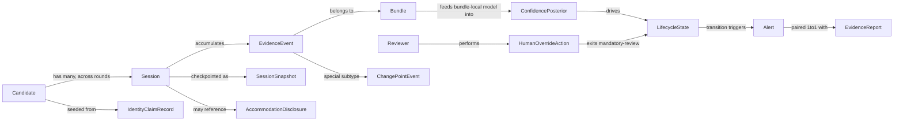

# Sherlock — Architecture Comprehension & Implementation Roadmap

Prepared from the Sherlock Identity-Integrity RFC (§1–19) as the single source of truth. No architectural decision in the RFC is altered, simplified, or second-guessed below — this is comprehension and sequencing, not redesign.

## 1. Executive Summary

Sherlock is a **decision-support system**, never a hiring authority, that maintains a continuously-updated, explainable, calibrated belief about whether the person answering interview questions is the applicant of record. It is not a face-match product; face matching is one weak input among many independently-attackable signal families (pre-call claims, platform metadata, visual, audio, linguistic, consented device/OS behavior, active-elicitation, meta-signals, cross-session history).

The engineering core is **Bayesian log-odds fusion** (ADR-1): every evidence event contributes an additive log-likelihood-ratio term, grouped into *bundles* to prevent correlated double-counting, producing a **Beta-distributed posterior** (mean + credible interval, not a point estimate). That posterior drives an **eight-state hysteresis lifecycle FSM** (ADR-4) whose single most load-bearing distinction is `LOST_CONFIDENCE` (evidence went quiet — ambiguous) versus `DISQUALIFIED` (a specific, corroborated contradiction — mandatory human review, *never* auto-rejection, per ADR-3). Every state and alert is contractually paired with a deterministic, fact-grounded **Evidence Report**; an LLM only rephrases already-computed facts and is structurally barred from touching score or state (ADR-2).

Architecturally, the system is deliberately **not** a microservices/event-bus/event-sourcing/vector-DB design. At the stated scale (low hundreds of concurrent sessions, a few thousand events/sec system-wide), the RFC chooses a **modular monolith orchestrator** (session-sharded via consistent hashing, ADR-8) plus **exactly one** justified separate deployable — a GPU-bound **model-serving layer** (ADR-6) — backed by **one relational database** holding an append-only evidence ledger and periodic state snapshots (ADR-7). Every piece of deferred infrastructure (event bus, vector DB, CQRS) has a stated, measurable scale threshold at which it becomes correct, not a launch date (ADR-14).

Reliability is protected by a **three-state signal-health contract** (`OK`/`NO_SIGNAL_DETECTED`/`SERVICE_UNAVAILABLE`, ADR-11) so an outage is never mistaken for negative evidence, and a **per-event log-LR clamp** (ADR-12) so no single signal — compromised or merely miscalibrated — can swing a session across tiers. Fairness and human-override are architectural invariants, not policy promises: abstention (`UNKNOWN`) defaults to no-suspicion (ADR-15), and device/OS "assistance" signals are kept on a structurally separate track from identity (ADR-16).

## 2. Core Domain Model

**Major entities**

- **Candidate** — the person under identity assessment; holds an identity claim (name, email, resume/reference photo) and, where the product spans rounds, historical reference embeddings (Bundle I).
- **Session** — one live interview instance; the unit of state. Owns the current lifecycle state, the per-bundle log-odds accumulators, and the Beta posterior parameters.
- **EvidenceEvent** — a single, timestamped, signal-health-tagged observation from one bundle (e.g., a face-embedding similarity reading). Immutable once written.
- **Bundle** — a named grouping of correlated signals (Visual, Audio, Metadata/Claim, Linguistic, Device/OS) that is fused internally before entering the global log-odds sum; the unit of correlation containment.
- **ChangePointEvent** — a distinguished, heavily-weighted EvidenceEvent subtype produced by the CUSUM/change-point layer; never decays in the ledger (ADR-5).
- **ConfidencePosterior** — the derived, decaying, live view of a Session's evidence: log-odds sum, Beta(mean, credible interval).
- **LifecycleState** — one of the eight FSM states; transitions are hysteresis- and dwell-time-gated and are themselves durable, audit-relevant facts.
- **EvidenceReport** — the structured, deterministic explanation object (top contributing signals, contradictions, missing evidence, alternative hypotheses) attached to every state/alert; optionally rendered to prose by the constrained LLM layer.
- **Alert** — a low-noise, interviewer/reviewer-facing notification, always paired 1:1 with an EvidenceReport.
- **HumanOverrideAction** — a Reviewer's explicit action on a `DISQUALIFIED`/`LOST_CONFIDENCE` session; the only way a session exits mandatory-review states.
- **SessionSnapshot** — a periodic checkpoint of a Session's derived state for fast crash recovery (§9.3).
- **AccommodationDisclosure** — a pre-interview, candidate-facing disclosure record that removes a legitimate multi-person/no-camera setup from the suspicion pool entirely (ADR-13).
- **IdentityClaimRecord** — the ATS/scheduling-sourced pre-call record (name, email, calendar role, reference photo) that seeds the prior.

**Relationships**



**Responsibilities**

- Candidate/IdentityClaimRecord: supplies the prior (`O_0`) — never authoritative on its own.
- Session: the unit of concurrency, sharding, snapshotting, and lifecycle — everything else is scoped to it.
- Bundle: contains correlation — the reason fusion never double-counts a single underlying fact (e.g., "video track authenticity").
- ConfidencePosterior: the single source of truth for "how sure, and based on how much evidence" — never collapsed to a point estimate.
- LifecycleState: the sole human-actionable surface; encodes the FSM's non-negotiable invariant that `DISQUALIFIED` only triggers review, never autonomous action.
- EvidenceReport: the enforcement point for explainability-by-construction — no code path emits a status without one.

## 3. Complete Component Breakdown

**Client Agent** (browser extension; §9.5, ADR-9)
- Responsibility: emit consented Bundle F device/OS events (clipboard, focus/app-switch, keystroke *timing* only) over an authenticated channel; runs no local inference.
- Inputs: OS/browser permission grants; local clipboard/focus/keyboard-timing events.
- Outputs: session_id-tagged structured device/OS EvidenceEvents.
- Dependencies: authenticated connection to Orchestrator ingress API; candidate consent flow.

**Bundle Adapters** (Orchestrator-internal, one per §4 family: Claim, Metadata, Visual, Audio, Linguistic, Device/OS, Elicitation, Meta, Cross-Session)
- Responsibility: normalize raw inputs from the video platform, ATS, client agent, and model-serving into signal-health-tagged EvidenceEvents scoped to their bundle.
- Inputs: platform media/events, ATS/calendar record, client-agent events, model-serving inference results.
- Outputs: EvidenceEvents (`OK`/`NO_SIGNAL_DETECTED`/`SERVICE_UNAVAILABLE`-tagged) to the Fusion Engine.
- Dependencies: Model-Serving Layer (for Visual/Audio bundles), ATS integration, Client Agent (Device/OS bundle only).

**Fusion Engine** (Orchestrator-internal; §5, ADR-1)
- Responsibility: bundle-local likelihood combination, global log-odds accumulation with time-decay, Beta posterior maintenance, change-point/CUSUM detection per bundle.
- Inputs: EvidenceEvents from Bundle Adapters.
- Outputs: updated `(log_odds, Beta params)` per session; ChangePointEvents on regime shifts.
- Dependencies: Evidence Store (every event durably written before it affects the live score); per-event log-LR clamp (§13).

**State Manager / Lifecycle FSM** (Orchestrator-internal; §6, ADR-4)
- Responsibility: map the continuous posterior to one of eight discrete states via hysteresis and minimum-dwell-time rules; annotate `RECOVERED` permanently.
- Inputs: ConfidencePosterior updates, ChangePointEvents.
- Outputs: LifecycleState transitions (durable, audit-relevant).
- Dependencies: Fusion Engine; Evidence Store (transition history).

**Decision / Alert Engine** (Orchestrator-internal; §10)
- Responsibility: tie-breaking on ambiguous-but-tight posteriors, abstention (`UNKNOWN`) routing, active-elicitation triggering, alert generation.
- Inputs: LifecycleState transitions, Beta credible interval width.
- Outputs: Alerts (paired with EvidenceReport requests), active-elicitation prompts to the Interviewer UI.
- Dependencies: State Manager; Explanation Engine.

**Explanation Engine** (Orchestrator-internal; §8, ADR-2)
- Responsibility: deterministically build the structured EvidenceReport from fusion/state facts; pass it through a constrained LLM for prose, validating that no unsupported signal name appears (reject-and-regenerate on violation).
- Inputs: Fusion Engine/State Manager facts.
- Outputs: structured EvidenceReport (always); narrative prose (best-effort, off critical path).
- Dependencies: LLM service (Tier 3, non-critical — §13).

**Model-Serving Layer** (separate deployable; §9.2/9.6, ADR-6)
- Responsibility: GPU-bound inference — embedding extraction, liveness/anti-spoof, deepfake/voice-clone classifiers, ASR — stateless, autoscaled on queue depth/latency, adaptive sampling cadence.
- Inputs: media frames/audio chunks from the Orchestrator (sync/async RPC, no broker).
- Outputs: embeddings, classifier scores, transcripts — returned to Bundle Adapters.
- Dependencies: none upstream in-process; scales independently of session count.

**Evidence Store** (single relational database; §9.3, ADR-7)
- Responsibility: durably persist the append-only evidence-events table (audit/training-data source, never expired) and the session-state-snapshots table (fast recovery checkpoints).
- Inputs: EvidenceEvents, periodic snapshot writes from the Fusion Engine.
- Outputs: replay/query access for audit, recovery, and evaluation (§14).
- Dependencies: standard HA relational deployment (replication, failover).

**Session Registry & Router** (load balancer + lightweight KV registry; §9.4, ADR-8)
- Responsibility: consistent-hash routing of session events to the owning Orchestrator replica; rebalancing on replica churn.
- Inputs: session_id on every inbound event.
- Outputs: routed connection to the correct Orchestrator replica.
- Dependencies: Orchestrator replica set; degrades to stale-routing (not data loss) on registry unavailability, since the Evidence Store is the source of truth.

**Orchestrator** (modular monolith deployable; §9.2/9.6)
- Responsibility: host Bundle Adapters, Fusion Engine, State Manager, Decision/Alert Engine, and Explanation-request handling as in-process modules; horizontally replicated, session-sharded.
- Inputs: video-platform media/events, ATS/calendar record, Client Agent events, Model-Serving responses.
- Outputs: LifecycleState, Alerts, EvidenceReports pushed to the Interviewer UI/Reviewer Dashboard (WebSocket/SSE); EvidenceEvents/snapshots to the Evidence Store; RPC calls to Model-Serving.
- Dependencies: Evidence Store, Model-Serving Layer, Session Registry.

**Interviewer UI / Reviewer Dashboard** (§9.1/9.6, §6 Committee Note)
- Responsibility: render the simplified 3-tier live badge to interviewers ("Building confidence"/"Confirmed"/"Needs attention") and the full 8-state, evidence-report-backed view plus override actions to reviewers; surface `UNKNOWN`-rate aggregate anomalies (§10).
- Inputs: WebSocket/SSE push from Orchestrator.
- Outputs: HumanOverrideActions back to the Orchestrator.
- Dependencies: Orchestrator's real-time push channel.

**Compliance / Privacy Admin surface** (§9.1, §15)
- Responsibility: audited access to biometric evidence and the full audit trail; retention/residency configuration.
- Inputs: Evidence Store queries.
- Outputs: access-logged audit views.
- Dependencies: Evidence Store; access-control/audit-logging layer.

**Monitoring & Observability** (cross-cutting; §9.6, §13)
- Responsibility: dependency-criticality-tiered health tracking, aggregate anomaly detection on signal output distributions and `UNKNOWN` rates, latency-budget tracking.
- Inputs: signal-health statuses, latency traces from every component above.
- Outputs: ops alerts (distinct from candidate-facing Alerts).
- Dependencies: all components (read-only observation).

**Privacy & Compliance Layer** (cross-cutting; §9.6, §15)
- Responsibility: encryption at rest/in transit for biometric derivatives, purpose-limitation enforcement, consent/appeal flow, data-minimization (no raw-media retention beyond processing window absent explicit policy).
- Inputs: raw media in flight, consent records.
- Outputs: enforced retention/encryption policy across Evidence Store and Model-Serving.
- Dependencies: Evidence Store, Client Agent consent flow.

**External dependencies (integrated, not built):** Video Interview Platform (media/transcript/events source), ATS/Scheduling/Application Record (identity-claim source).

## 4. Runtime Data Flow

```mermaid
sequenceDiagram
  participant Platform as Video Platform
  participant Agent as Client Agent
  participant Orch as Orchestrator
  participant MS as Model-Serving
  participant DB as Evidence Store
  participant UI as Interviewer/Reviewer UI

  Platform->>Orch: media/audio/transcript/events
  Agent->>Orch: device/OS events (consented)
  Orch->>MS: embedding/liveness/deepfake/ASR RPC (adaptive cadence)
  MS-->>Orch: scores/embeddings/transcript
  Orch->>Orch: Bundle Adapter normalizes to EvidenceEvent (signal-health tagged)
  Orch->>DB: durable write of EvidenceEvent (ledger authoritative before scoring)
  Orch->>Orch: Fusion Engine updates log-odds + Beta posterior; change-point check
  Orch->>Orch: State Manager applies hysteresis/dwell-time FSM transition
  Orch->>Orch: Decision Engine: tie-break / abstain / trigger elicitation / alert
  Orch->>Orch: Explanation Engine builds structured EvidenceReport (+ best-effort LLM prose)
  Orch->>UI: push state/alert/report (WebSocket/SSE)
  Orch->>DB: periodic state snapshot (for recovery)
```

End-to-end target per §9.6/§12: **p50 < 1.5s, p95 < 3s** from capture to interviewer-visible change; Evidence Report narrative is best-effort and explicitly off this critical path (<5s). The absence of a message-broker hop (§9.2's decision) is what makes this budget achievable.

## 5. Repository Structure

A monorepo whose top-level folders map exactly onto the RFC's two deployables plus its explicitly-scoped satellite components — no folder introduces a seam the RFC didn't justify (guards against §9.2's "five teams stepping on one deployable" risk by keeping ownership boundaries == architectural boundaries).

- `orchestrator/` — the modular monolith deployable (§9.2)
  - `bundles/` — one subfolder per §4 family: `claim/`, `metadata/`, `visual/`, `audio/`, `linguistic/`, `device/`, `elicitation/`, `meta/`, `cross_session/`
  - `fusion/` — log-odds accumulator, Beta posterior, bundle-local combiners, change-point/CUSUM layer (§5)
  - `statemachine/` — 8-state FSM, hysteresis + dwell-time logic (§6)
  - `decision/` — tie-breaking, abstention, active-elicitation triggers, alerting (§10)
  - `explanation/` — structured EvidenceReport builder + constrained LLM adapter with validation/reject loop (§8)
  - `persistence/` — Evidence Store repositories: evidence-events, session-snapshots (§9.3)
  - `routing/` — session-registry client, replica-local session cache (§9.4)
  - `modelserving_client/` — RPC client + adaptive sampling-cadence controller
  - `api/` — ingress (platform/ATS/client-agent) and egress (WebSocket/SSE to UI)
  - `health/` — shared `OK`/`NO_SIGNAL_DETECTED`/`SERVICE_UNAVAILABLE` contract types and the per-event log-LR clamp (§13)
- `model-serving/` — the one separate deployable (§9.2)
  - `embeddings/`, `liveness/`, `deepfake_classifier/`, `voice_clone_classifier/`, `asr/`, `serving_api/`
- `client-agent/` — browser extension (§9.5); future desktop-companion variant slots in alongside without changing the orchestrator-side contract
- `dashboard/` — Interviewer UI (3-tier live badge) + Reviewer Dashboard (full 8-state, evidence, override, `UNKNOWN`-aggregate views) (§6 Committee Note, §9.1)
- `contracts/` — cross-component schemas shared by orchestrator, model-serving, client-agent, dashboard: EvidenceEvent, signal-health status, EvidenceReport, LifecycleState (single source of truth so bundle/FSM/report shapes can't drift between components)
- `eval/` — offline replay harness, synthetic §11 edge-case regression suite, ablation-study tooling, calibration (ECE) computation (§14)
- `infra/` — DB migrations for the two Evidence Store tables, load-balancer/consistent-hash and session-registry deployment config, model-serving autoscaling config
- `docs/adr/` — living mirror of §18's ADR registry, one file per ADR-1..16, updated as decisions evolve per their stated migration paths

## 6. Technology Stack (Inferred)

The RFC is explicit that it specifies no schemas, APIs, or infra-as-code — the items below are **inferred from stated architectural properties**, not mandated by the RFC, and should be confirmed as an early implementation decision rather than treated as settled fact.

- **Orchestrator language/runtime:** the RFC's properties — many lightweight, memory/IO-bound, per-session concurrent state machines; in-process modules, not network-separated services; horizontal replication; sub-100ms internal step latency — point toward a statically-typed, concurrency-native runtime (e.g., Go, Java/Kotlin, or C#/.NET are all strong fits; a typed Node.js/TypeScript service is a plausible alternative). Not specified by the RFC; flagged as an open decision.
- **Model-Serving language/runtime:** Python is the practical inference-ecosystem default (PyTorch/TensorFlow-class frameworks) for embedding extraction, liveness/deepfake/voice-clone classifiers, and ASR; served behind a stateless autoscaled API, GPU-pool-backed.
- **Persistence:** "one relational database" is explicit (§9.3, ADR-7); PostgreSQL is the natural inference given the RFC's own criteria — "well-understood, widely-operated," standard replication/read-replica support, transactional guarantees for the append-only ledger + snapshot tables.
- **Session registry:** a small, low-write-volume key-value store (e.g., Redis-class) is the natural fit for "one row per active session" (§9.4); not named explicitly.
- **Session routing:** a load balancer with consistent-hashing support (§9.4) — an explicit requirement, not a named product.
- **Real-time push to UI:** WebSocket/SSE, explicitly named (§9.6).
- **RPC between Orchestrator and Model-Serving:** synchronous/async RPC without a broker, explicitly named as a hard requirement (§9.2/9.6) — gRPC or plain HTTP are typical fits; not specified further.
- **LLM narrative layer:** any LLM provider is compatible provided it sits behind the constrained, fact-validated wrapper (§8); must support fast rejection/regeneration on unsupported-claim detection.
- **Client Agent:** browser extension (Manifest-V3-class), narrowly scoped to clipboard/focus/keyboard-timing event emission only — explicit (§9.5); a future desktop companion is noted as a like-for-like extension point, not a near-term build.
- **Observability:** standard metrics/logging/tracing stack (e.g., Prometheus/Grafana-class + structured logs) to support the dependency-criticality tiering and aggregate anomaly detection in §13 — not named explicitly, inferred from the operational requirements.

## 7. Milestone-by-Milestone Implementation Roadmap

Sequenced to match the RFC's own **Prototype -> Pilot** phasing (§16); each milestone below is independently compilable — the codebase builds and runs end-to-end (with stubs where a later milestone's real dependency isn't built yet) at every step. Production/Enterprise/Global-scale milestones are intentionally *not* detailed here, per the RFC's own stance that infrastructure is added only against measured scale thresholds, not scheduled in advance (ADR-14).

**M0 — Contracts & repo scaffolding**
- Objective: establish the shared vocabulary every other milestone depends on.
- Deliverables: `contracts/` schemas for EvidenceEvent, signal-health status (`OK`/`NO_SIGNAL_DETECTED`/`SERVICE_UNAVAILABLE`), LifecycleState enum, EvidenceReport shape; empty-but-building skeletons for `orchestrator/` and `model-serving/`.
- Dependencies: none.
- Estimated files: ~10-15 (schema definitions, module stubs, build config per deployable).

**M1 — Evidence Store**
- Objective: durable persistence for the two tables the whole system leans on.
- Deliverables: evidence-events table + session-state-snapshots table, migrations, repository interfaces in `orchestrator/persistence/`.
- Dependencies: M0.
- Estimated files: ~8-10 (migrations, repository, tests).

**M2 — Claim & Metadata bundle adapters + cold-start FSM**
- Objective: first vertical slice with zero ML dependency — pre-call identity-claim and platform-metadata signals only, feeding a State Manager that only ever reaches `UNKNOWN`/`POSSIBLE_CANDIDATE`.
- Deliverables: `bundles/claim/`, `bundles/metadata/`, minimal `statemachine/` (subset of states), ATS-integration stub.
- Dependencies: M0, M1.
- Estimated files: ~15-20.

**M3 — Fusion Engine core**
- Objective: implement §5's math in isolation and unit-testable: log-odds accumulation with decay, bundle-local combination, Beta posterior.
- Deliverables: `fusion/` module with hand-set (expert-elicited, per §16 Prototype phase) likelihood ratios for the bundles built so far.
- Dependencies: M2.
- Estimated files: ~10-12.

**M4 — Full 8-state lifecycle FSM**
- Objective: complete §6's state machine with hysteresis and minimum dwell-time, including the `LOST_CONFIDENCE`/`DISQUALIFIED`/`RECOVERED` structure and permanent-annotation behavior.
- Deliverables: full `statemachine/` module, explicit transition-coverage tests (per §6's own risk note).
- Dependencies: M3.
- Estimated files: ~10-15.

**M5 — Decision/Alert Engine + abstention**
- Objective: close the first true end-to-end slice (claim+metadata only): tie-breaking, `UNKNOWN` abstention routing, alert emission.
- Deliverables: `decision/` module wired to State Manager; first Alert -> EvidenceReport pairing (structured only, no LLM yet).
- Dependencies: M4.
- Estimated files: ~10.

**M6 — Explanation Engine (structured report)**
- Objective: deterministic EvidenceReport generation, the invariant that no status is emitted without one.
- Deliverables: `explanation/` structured-report builder; contract tests asserting every Alert/state carries a report.
- Dependencies: M5.
- Estimated files: ~6-8.

**M7 — Session routing & horizontal replication**
- Objective: make the Orchestrator deployable multi-replica-safe.
- Deliverables: `routing/` consistent-hash client, session registry integration, snapshot-based recovery path exercised on replica restart.
- Dependencies: M1, M5.
- Estimated files: ~10-12.

**M8 — Model-Serving Layer stood up**
- Objective: bring up the second deployable with real GPU-bound inference for embeddings + liveness, behind the RPC contract.
- Deliverables: `model-serving/embeddings/`, `model-serving/liveness/`, `serving_api/`, `orchestrator/modelserving_client/` with adaptive sampling-cadence controller.
- Dependencies: M0 (contracts), independent of M2-M7's orchestrator internals otherwise.
- Estimated files: ~15-20.

**M9 — Visual + Audio bundles, change-point layer**
- Objective: wire self-consistency embeddings and lip-sync/voice-consistency into Fusion; add the CUSUM/change-point detector.
- Deliverables: `bundles/visual/`, `bundles/audio/`, change-point module inside `fusion/`.
- Dependencies: M3, M8.
- Estimated files: ~15-18.

**M10 — Client Agent + Device/OS bundle (parallel track)**
- Objective: add Bundle F on its own near-zero-weight parallel track (ADR-16), never folded into the identity score.
- Deliverables: `client-agent/` extension, `bundles/device/` adapter, consent flow.
- Dependencies: M0; integrates into M9's fusion output without altering identity weighting.
- Estimated files: ~12-15.

**M11 — Active elicitation + Linguistic bundle**
- Objective: complete the signal set with borderline/change-point-triggered elicitation and identity-consistency-only linguistic checks.
- Deliverables: `bundles/elicitation/`, `bundles/linguistic/`, trigger wiring from Decision Engine into Interviewer UI prompts.
- Dependencies: M5, M9.
- Estimated files: ~10-12.

**M12 — LLM narrative layer**
- Objective: add the constrained, fact-validated prose layer on top of M6's structured report, fully optional/degradable per §13.
- Deliverables: `explanation/` LLM adapter with validate-and-reject loop; failure-mode test confirming score/state are unaffected when the LLM is down.
- Dependencies: M6.
- Estimated files: ~6-8.

**M13 — Interviewer UI / Reviewer Dashboard**
- Objective: ship the 3-tier live badge and the full 8-state reviewer dashboard with override actions and accommodation-disclosure flow.
- Deliverables: `dashboard/` app, WebSocket/SSE client, HumanOverrideAction round-trip, `UNKNOWN`-rate aggregate view.
- Dependencies: M4, M5, M6, M7.
- Estimated files: ~20-25.

**M14 — Reliability hardening: signal-health contract + defense-in-depth**
- Objective: make §13's three-state contract and per-event log-LR clamp verifiably load-bearing end-to-end, plus dependency-criticality-tiered degradation paths.
- Deliverables: contract enforcement across every bundle adapter, clamp implementation in `fusion/`, chaos-style tests for each Reliability-table failure mode (§13).
- Dependencies: M9, M10, M11.
- Estimated files: ~10-12.

**M15 — Evaluation harness**
- Objective: stand up offline replay, synthetic §11 edge-case regression suite, ablation tooling, and calibration (ECE) metrics as first-class, not an afterthought.
- Deliverables: `eval/` replay runner, edge-case fixtures for every §11 row, ablation runner, ECE calculator.
- Dependencies: M9-M14 (needs the full signal/fusion/state pipeline to replay against).
- Estimated files: ~15-20.

**M16 — Security/privacy/compliance pass**
- Objective: close the Pilot-readiness bar — encryption at rest/in transit for biometric derivatives, access-control/audit logging, consent + appeal flow, data-residency configuration.
- Deliverables: Privacy & Compliance Layer integrated across Evidence Store and Model-Serving; audit-log coverage for every biometric-evidence view.
- Dependencies: M1, M13.
- Estimated files: ~10-15.

## 8. Risks During Implementation

- **Accidental flat-independence regression:** an engineer implementing bundle-local combiners incrementally could easily slip into treating signals as globally independent (multiplying raw LRs instead of respecting bundle boundaries), silently reintroducing the exact double-counting risk §5 rejected.
- **Hysteresis/dwell-time mistuning:** eight states with hysteresis is materially more surface area than a three-tier model (§6's own admitted tradeoff); without dedicated transition-coverage tests (not just end-to-end scenarios), a too-tight hysteresis band can flap in practice while passing naive tests.
- **LLM validation loop implemented loosely:** if the "reject and regenerate on unsupported claim" rule (§8) is implemented as a soft warning rather than a hard gate, ADR-2's invariant (LLM cannot affect score/state) is technically preserved but its practical guarantee — no hallucinated fact reaches a reviewer — is not.
- **Asymmetric path testing:** per §9.2's own event-sourcing rejection rationale, the snapshot/recovery path is exercised far less often than the live path in normal operation; under-testing it is the most likely place a "few seconds of acceptable loss" quietly becomes a correctness bug.
- **Client Agent scope creep:** the RFC is explicit that keystroke *timing*, not *content*, is captured (§9.5); an implementation shortcut (e.g., reusing an off-the-shelf keylogging library) could silently violate this boundary and create a serious privacy/legal exposure.
- **Ledger/live-score lifetime conflation:** §7/§9.3 depend on two objects with genuinely different lifetimes (decaying live score vs. never-pruned ledger); a shared-mutable-state implementation shortcut could accidentally let ledger writes decay or let live-score logic write directly to the ledger without the durability-before-scoring guarantee (§10).
- **Evaluation harness built last:** if `eval/` (M15) is deferred rather than built incrementally alongside the fusion/state pipeline, retrofitting replay/ablation instrumentation onto an already-complex system is far more expensive than instrumenting it from M3 onward.
- **Fairness instrumentation treated as optional:** because disparate-impact metrics (§14) require no new score-affecting code, it is easy to schedule them last or drop them under time pressure — but the RFC treats this as a correction to the brief (§2, correction #2), not a nice-to-have.
- **Team-boundary drift from module boundaries:** §9.2's own Committee Note flags that a monolith owned by multiple teams stepping on each other is the real risk, not a technical one; if implementation teams are assigned by bundle without enforcing the module-boundary discipline in `orchestrator/`, this risk materializes early rather than at scale.
- **Recalibration seam omitted:** if Phase-1 likelihood ratios are hardcoded as literals scattered through bundle logic rather than isolated as swappable parameters, §5/§16's stated Phase-3 migration (recalibrate from labeled outcomes, same structure, better numbers) becomes a rewrite instead of a data-driven update.

## 9. Areas Where Architectural Discipline Must Be Preserved

- **No autonomous consequential action, ever (ADR-3).** `DISQUALIFIED` triggers mandatory human review only. This must never acquire an auto-execute path, even at extreme confidence — the RFC explicitly rejected this at >99.9% confidence.
- **LLM confinement (ADR-2).** The narrative layer must remain a one-way, fact-validated rendering step with zero write access to score or state, under any future feature pressure to "let the LLM suggest an adjustment."
- **Bundle-local dependency structure and the log-LR clamp (§5, §13).** Any new signal or bundle must be assigned a bundle before its first likelihood ratio is written, and every event must pass through the clamp — no exceptions for "obviously reliable" signals.
- **Signal-health three-state contract (ADR-11).** Every adapter, present and future, must propagate `OK`/`NO_SIGNAL_DETECTED`/`SERVICE_UNAVAILABLE` distinctly; collapsing an outage into `NO_SIGNAL_DETECTED` anywhere reintroduces the exact false-fraud-during-outage bug class §13 was written to close.
- **Asymmetric evidence decay (ADR-5).** Change-point-flagged evidence must never decay in the ledger, even as the live score recovers — this is what makes `RECOVERED` a real annotation instead of silent amnesia.
- **Abstention semantics (ADR-15).** `UNKNOWN — insufficient evidence` must remain a distinct state from a numeric near-50% prior, and must never be "improved" by defaulting toward suspicion under future tuning pressure.
- **Device/OS track separation (ADR-16).** Bundle F must remain a structurally separate, near-zero-weight track from identity confidence, even under future pressure to fold it in "at a small weight" for a unified score.
- **Eight-state internal authority vs. UI simplification (§6 Committee Note).** The dashboard may display a collapsed 3-tier badge, but the full FSM must remain authoritative underneath for every reviewer, audit, and tuning use — no shortcut that lets the UI's simplified view become the system of record.
- **Infrastructure-addition gating (ADR-14).** Event bus, vector DB, CQRS, and any other deferred pattern may only be introduced against the specific measured-scale condition stated in §9's migration paths — never pre-emptively by an implementer anticipating future scale.
- **Ledger-authoritative-before-score ordering (§10).** Every evidence event must be durably written before it is allowed to affect the live score; this ordering must not be relaxed for latency under any future performance-tuning pass.
