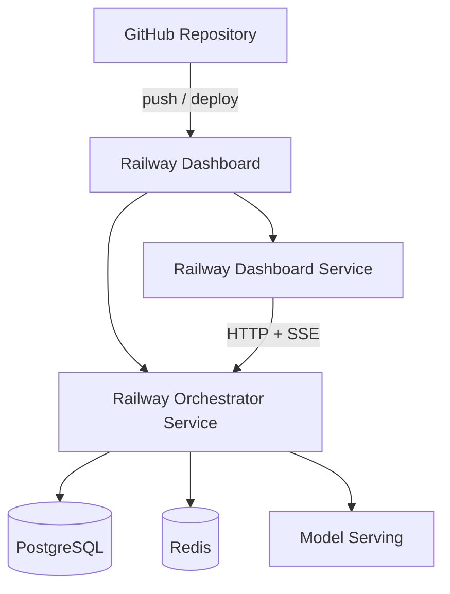

# Deployment Architecture

Railway deployment topology for the Sherlock Pilot stack. The dashboard and
orchestrator are separate Railway services; data stores and model-serving may
run as additional services or containers.

## Data flow

1. **GitHub** — source of truth; CI runs on every push/PR.
2. **Railway Dashboard** — connects the repo and deploys services.
3. **Orchestrator** — binds to Railway `PORT`; connects to Postgres, Redis, and model-serving.
4. **PostgreSQL** — evidence events and session snapshots.
5. **Redis** — session registry for multi-replica routing.
6. **Model Serving** — embedding and liveness inference (Pilot stubs).
7. **Reviewer Dashboard** — static React app calling orchestrator HTTP/SSE APIs.

## Environment variables (orchestrator)

| Variable            | Purpose                                                              |
| ------------------- | -------------------------------------------------------------------- |
| `PORT`              | Railway-assigned HTTP port (preferred over `ORCHESTRATOR_HTTP_PORT`) |
| `POSTGRES_*`        | Evidence Store connection                                            |
| `REDIS_URL`         | Session registry                                                     |
| `MODEL_SERVING_URL` | Inference service base URL                                           |

## Environment variables (dashboard)

| Variable                | Purpose                             |
| ----------------------- | ----------------------------------- |
| `VITE_ORCHESTRATOR_URL` | Orchestrator base URL at build time |
| `PORT`                  | Railway static server port          |

See [README § Railway Deployment](../README.md#railway-deployment) for setup steps.
