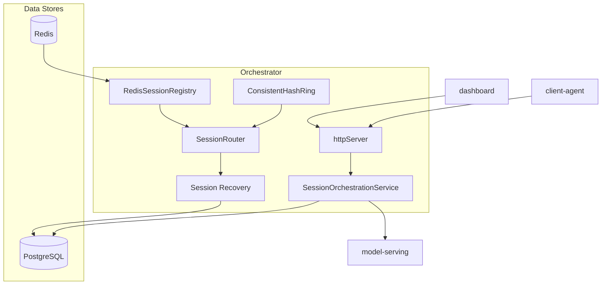

# Infrastructure Architecture

Deployable components and supporting infrastructure in the current
implementation.

**Note:** Session Recovery is implemented as `SessionLifecycleStore` (snapshot
replay on replica handoff). `SessionRouter` is implemented and tested but not
wired into the single-replica `orchestrator/src/index.ts` entrypoint; ingress
routing is deferred to the load balancer per RFC §9.4.
