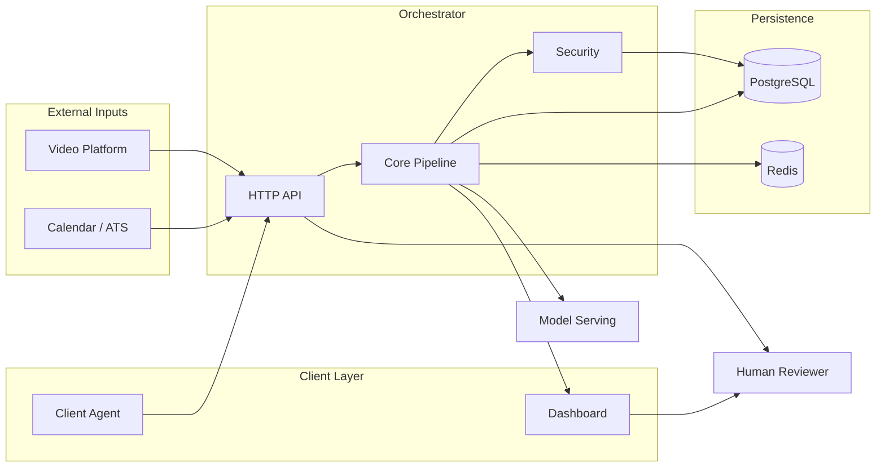

# Overall System Architecture

High-level view of the implemented system (M0–M16). Component names reflect
actual deployables and integration points in the repository.

```mermaid
flowchart LR

  subgraph EXT["External Inputs"]
    VP["Video Platform"]
    ATS["Calendar / ATS"]
  end

  subgraph CLIENT["Client Layer"]
    CA["Client Agent"]
    DASH["Dashboard"]
  end

  subgraph CORE["Orchestrator"]
    API["HTTP API"]
    PIPE["Core Pipeline"]
    SEC["Security"]
  end

  subgraph DATA["Persistence"]
    PG[("PostgreSQL")]
    RD[("Redis")]
  end

  MS["Model Serving"]
  REV["Human Reviewer"]

  VP --> API
  ATS --> API
  CA --> API
  API --> PIPE
  PIPE --> SEC
  SEC --> PG
  PIPE --> PG
  PIPE --> RD
  PIPE --> MS
  PIPE --> DASH
  DASH --> REV
  API --> REV
```
