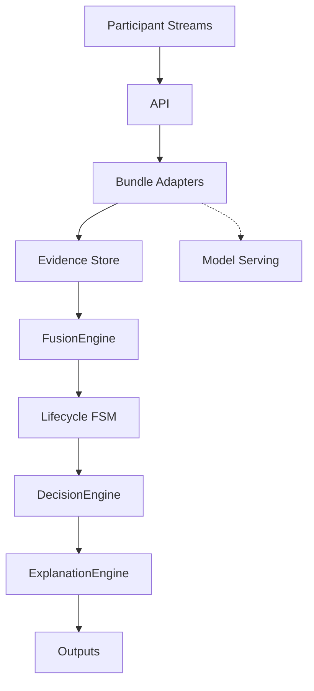

# Runtime Processing Pipeline

End-to-end request flow inside the orchestrator, as implemented by
`SessionOrchestrationService` and its downstream modules.

`ChangePointDetector` and `LlmNarrativeAdapter` sit on the visual/audio and
explanation paths respectively; they are omitted here to keep the main pipeline
readable.
