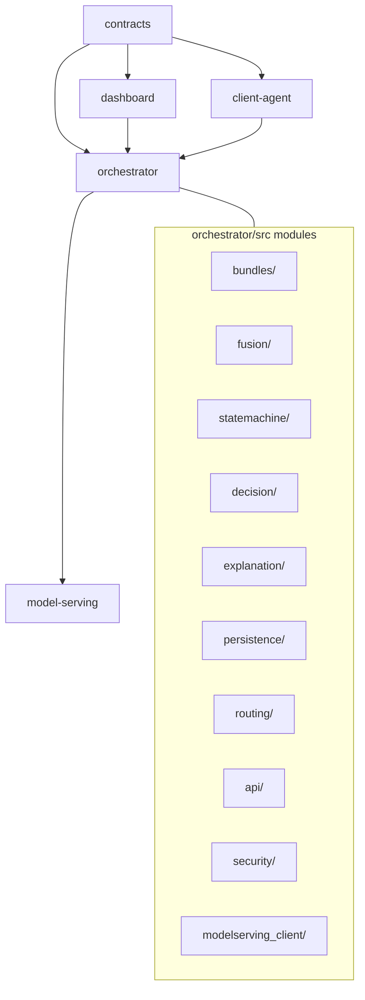

# Repository Structure

How the major monorepo packages relate. The orchestrator hosts all in-process
domain modules; other packages are separate deployables or clients.

`eval/` lives under `orchestrator/src/eval/` as offline tooling and is not on
the live request path.
