# Sherlock — Implementation Architecture Diagram

This diagram reflects the **current repository** (M0–M16), not the original
implementation plan. Component names match actual modules in the codebase.

```mermaid
flowchart LR

  subgraph CLIENT["Client Layer"]
    Browser
    ClientAgent["Client Agent"]
    Dashboard
  end

  subgraph EXT["External Inputs"]
    MeetTeamsZoom["Google Meet / Teams / Zoom"]
    ParticipantMeta["Participant Metadata"]
    AudioStreams["Audio Streams"]
    VideoStreams["Video Streams"]
    Transcript["Transcript"]
    CalendarATS["Calendar / ATS Metadata"]
  end

  subgraph API["API Layer"]
    HTTPServer["httpServer - HTTP API"]
    SessionOrchestrationService
    SessionEventBus
  end

  subgraph BUNDLES["Bundle Adapters"]
    ClaimBundleAdapter["ClaimBundleAdapter"]
    MetadataBundleAdapter["MetadataBundleAdapter"]
    VisualBundleAdapter["VisualBundleAdapter"]
    AudioBundleAdapter["AudioBundleAdapter"]
    DeviceBundleAdapter["DeviceBundleAdapter"]
    LinguisticBundleAdapter["LinguisticBundleAdapter"]
    ElicitationBundleAdapter["ElicitationBundleAdapter"]
  end

  subgraph MODEL["Model Serving"]
    HttpModelServingClient["HttpModelServingClient"]
    ServingAPI["Model Serving API - FastAPI"]
    EmbeddingExtractor["EmbeddingExtractor"]
    LivenessDetector["LivenessDetector"]
  end

  subgraph EVIDENCE["Evidence Layer"]
    EncryptingRepo["EncryptingEvidenceEventRepository"]
    EvidenceStore["Evidence Store"]
    PostgreSQL["PostgreSQL"]
    SessionSnapshots["Session Snapshots"]
  end

  subgraph INTEL["Intelligence Layer"]
    FusionEngine["FusionEngine"]
    ChangePointDetector["ChangePointDetector"]
    LifecycleStateManager["LifecycleStateManager"]
    DecisionEngine["DecisionEngine"]
    ExplanationEngine["ExplanationEngine"]
    LlmNarrativeAdapter["LlmNarrativeAdapter"]
  end

  subgraph INFRA["Infrastructure"]
    RedisSessionRegistry["RedisSessionRegistry"]
    SessionRouter["SessionRouter"]
    SessionLifecycleStore["SessionLifecycleStore"]
    ConsistentHashRing["ConsistentHashRing"]
  end

  subgraph SEC["Security"]
    FieldEncryption["fieldEncryption"]
    AuditLogRepository["InMemoryAuditLogRepository"]
    AppealRepository["InMemoryAppealRepository"]
  end

  subgraph OUT["Outputs"]
    CandidateDecision["Candidate Decision"]
    ConfidenceScore["Confidence Score"]
    EvidenceReport["Evidence Report"]
    DashboardUpdates["Dashboard Updates"]
    HumanReview["Human Review"]
  end

  MeetTeamsZoom --> HTTPServer
  ParticipantMeta --> HTTPServer
  AudioStreams --> HTTPServer
  VideoStreams --> HTTPServer
  Transcript --> HTTPServer
  CalendarATS --> HTTPServer

  ClientAgent --> HTTPServer
  Browser --> Dashboard

  HTTPServer --> SessionOrchestrationService
  SessionOrchestrationService --> ClaimBundleAdapter
  SessionOrchestrationService --> SessionEventBus
  SessionEventBus --> Dashboard

  VisualBundleAdapter --> HttpModelServingClient
  AudioBundleAdapter --> HttpModelServingClient
  HttpModelServingClient --> ServingAPI
  ServingAPI --> EmbeddingExtractor
  ServingAPI --> LivenessDetector

  ClaimBundleAdapter --> EncryptingRepo
  MetadataBundleAdapter --> EncryptingRepo
  VisualBundleAdapter --> EncryptingRepo
  AudioBundleAdapter --> EncryptingRepo
  DeviceBundleAdapter --> EncryptingRepo
  LinguisticBundleAdapter --> EncryptingRepo
  ElicitationBundleAdapter --> EncryptingRepo

  EncryptingRepo --> FieldEncryption
  EncryptingRepo --> EvidenceStore
  EvidenceStore --> PostgreSQL
  SessionLifecycleStore --> SessionSnapshots
  SessionSnapshots --> PostgreSQL

  EvidenceStore --> FusionEngine
  FusionEngine --> LifecycleStateManager
  ChangePointDetector --> LifecycleStateManager
  VisualBundleAdapter --> ChangePointDetector
  AudioBundleAdapter --> ChangePointDetector
  SessionLifecycleStore --> LifecycleStateManager
  LifecycleStateManager --> DecisionEngine
  DecisionEngine --> ExplanationEngine
  ExplanationEngine --> LlmNarrativeAdapter

  RedisSessionRegistry --> SessionRouter
  ConsistentHashRing --> SessionRouter
  SessionRouter --> SessionLifecycleStore

  SessionOrchestrationService --> AuditLogRepository
  SessionOrchestrationService --> AppealRepository

  DecisionEngine --> CandidateDecision
  FusionEngine --> ConfidenceScore
  ExplanationEngine --> EvidenceReport
  LlmNarrativeAdapter --> EvidenceReport
  SessionEventBus --> DashboardUpdates
  CandidateDecision --> HumanReview
  HTTPServer --> HumanReview
```

## Notes

- **SessionRouter** / **RedisSessionRegistry** are implemented and tested; the
  single-replica `orchestrator/src/index.ts` entrypoint does not wire ingress
  enforcement yet (RFC §9.4 defers routing to the load balancer).
- **Model Serving** uses Pilot stubs (`StubEmbeddingExtractor`,
  `StubLivenessDetector`) — no real GPU models are loaded.
- **Security** audit log and appeals use in-memory repositories in the current
  Pilot deployment.
